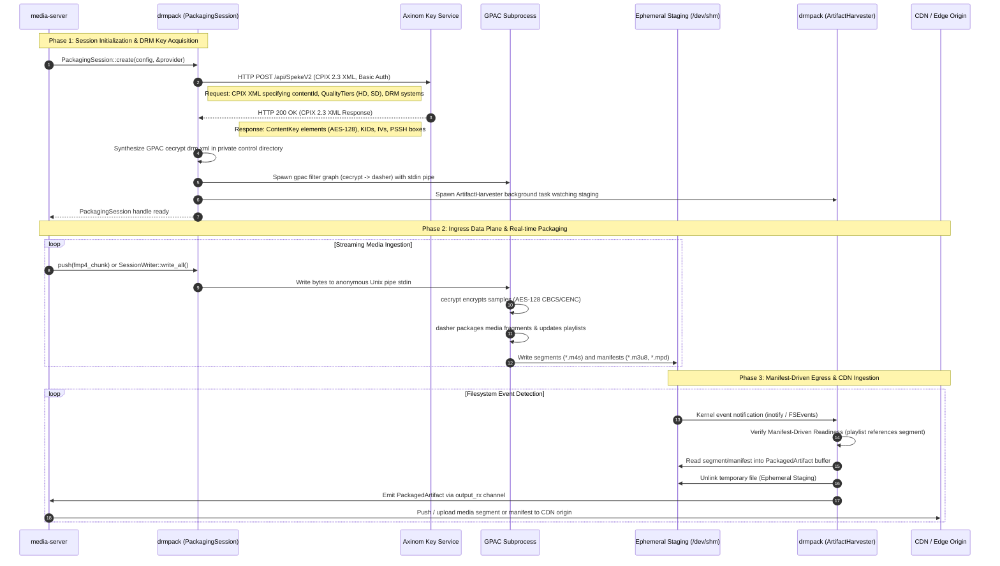
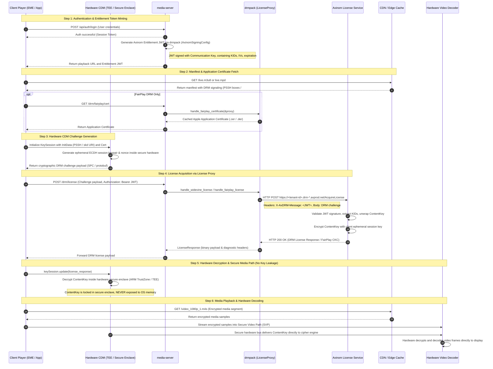

# drmpack

Native Rust DRM packaging and manifest generation library orchestrating GPAC filters for CENC/CBCS fMP4 and HLS/DASH delivery with zero disk I/O.

## Overview

`drmpack` is an in-process packaging orchestrator designed for high-throughput media servers (such as `media-server`). It accepts multiplexed fragmented MP4 (fMP4) streams in memory, pipes them directly into GPAC filter graphs over anonymous Unix pipes, and emits encrypted CMAF segments and playlists via an asynchronous in-memory channel.

By bypassing physical disk writes entirely on both ingress and egress, `drmpack` eliminates disk wear, reduces segment-to-manifest latency to sub-second ranges, and guarantees synchronization between media segments and manifest updates.

## Architecture

`drmpack` separates operations into a control plane and a data plane:

### Control Plane

- Key Acquisition: Fetches content keys, key IDs (KIDs), and PSSH metadata at session initialization using pluggable key providers.
- Configuration Generation: Dynamically synthesizes GPAC `cecrypt` XML definitions mapping track IDs to cryptographic keys, initialization vectors (IVs), and DRM system signaling.
- Process Supervision: Launches and monitors GPAC worker subprocesses via `tokio::process::Command`, capturing stderr in background tasks and providing fail-fast detection of process crashes.

### Data Plane

- Media Ingress: Pushes raw fMP4 chunks into GPAC's standard input pipe through `PackagingSession::push()` or `SessionWriter` (an adapter implementing `tokio::io::AsyncWrite`).
- Media Egress: `ArtifactHarvester` detects finished segments and updated manifests from ephemeral staging using kernel filesystem events (`inotify`/`FSEvents`), delivering `PackagedArtifact` items through a bounded asynchronous channel.
- Manifest-Driven Readiness: Emits media segments only after GPAC has completely flushed the segment and referenced it in the manifest, eliminating partial-read race conditions for downstream edge handlers.

```
+-------------------------------------------------------------------------------+
|                                 media-server                                  |
|                                                                               |
|  +--------------------+                     +------------------------------+  |
|  | Input fMP4 Stream  |                     | Downstream Edge / CDN Serv   |  |
|  +---------+----------+                     +--------------^---------------+  |
|            |                                               |                  |
+------------|-----------------------------------------------|------------------+
             |                                               |
             | push() / SessionWriter                        | PackagedArtifact
             v                                               | (output_rx)
+------------+-----------------------------------------------+------------------+
| drmpack                                                                       |
|                                                                               |
|  +--------------------+        +---------------------+                        |
|  | KeyProvider        |        | ProcessSupervisor   |                        |
|  | (Axinom/CPIX/Raw)  |        | (stderr/crash/exit) |                        |
|  +---------+----------+        +----------+----------+                        |
|            |                              |                                   |
|            | KeySet / XML                 |                                   |
|            v                              v                                   |
|  +---------------------------------------------------+                        |
|  | GPAC Subprocess (cecrypt -> dasher filter graph)   |                        |
|  +-------------------------+-------------------------+                        |
|                            |                                                  |
|                            v writes segments & manifests                      |
|  +---------------------------------------------------+                        |
|  | Ephemeral Storage Staging (/dev/shm or tmpfs)     |                        |
|  +-------------------------+-------------------------+                        |
|                            |                                                  |
|                            v inotify / FSEvents                               |
|  +---------------------------------------------------+                        |
|  | ArtifactHarvester (Manifest-Driven Readiness)     |                        |
|  +---------------------------------------------------+                        |
+-------------------------------------------------------------------------------+
```

### Packaging and Ingestion Data Flow

The following sequence diagram illustrates the lifecycle of a packaging session, key acquisition from Axinom Key Service, live fMP4 ingestion through anonymous Unix pipes, and manifest-driven artifact delivery to `media-server` for CDN distribution:



#### Detailed Packaging Flow Breakdown

| Step | Component | Description |
| :--- | :--- | :--- |
| **1** | `media-server` | Calls `PackagingSession::create(config, &provider)` declaring stream renditions, latency mode (`Standard` or `LowLatency`), and encryption scheme (`Cbcs`, `Cenc`, or `Dual`). |
| **2 - 3** | `drmpack` & Axinom Key Service | `drmpack` constructs a DASH-IF CPIX 2.3 XML request (`<cpix:CPIX>`) specifying `contentId`, quality tiers, and target DRM systems, dispatched over HTTP POST with Basic Auth to Axinom's SPEKE v2 tenant endpoint. Axinom returns an XML response containing AES-128 ContentKeys, KIDs, IVs, and PSSH boxes. |
| **4** | `drmpack` Control Plane | Generates a private `drm.xml` mapping 1-based ISO-BMFF track IDs to ContentKeys and PSSH metadata for GPAC's `cecrypt` filter. |
| **5 - 6** | GPAC & Harvester Spawning | Spawns the `gpac` child process with an anonymous Unix pipe (`pipe://stdin:fmt=mp4`) connected to `stdin`, and spawns the `ArtifactHarvester` background task to watch ephemeral staging (`/dev/shm`). |
| **7 - 11** | Media Ingress & Encryption | `media-server` streams muxed fMP4 chunks via `session.push()` or `SessionWriter`. Bytes flow into GPAC's stdin pipe without disk I/O. The `cecrypt` filter encrypts media samples, and `dasher` writes packaged `.m4s` segments and playlists into staging. |
| **12 - 17** | Manifest-Driven Harvesting & CDN Delivery | `ArtifactHarvester` detects writes via `inotify`/`FSEvents`. It guarantees **Manifest-Driven Readiness**: a media segment is only read after GPAC has updated the `.m3u8` manifest referencing it. Staging files are ingested into memory and immediately unlinked. `media-server` receives `PackagedArtifact` items over the async channel and forwards them to the CDN or HTTP edge cache. |

### Playback and DRM License Acquisition Flow

The following sequence diagram details end-to-end user authentication, manifest retrieval, DRM challenge creation inside hardware Content Decryption Modules (CDM), license proxying through `drmpack`, and direct hardware video decoding in isolated memory:



#### Detailed Playback and Decryption Flow Breakdown

| Step | Entity | Description |
| :--- | :--- | :--- |
| **1 - 4** | Authentication & Token Minting | The client authenticates with `media-server`. Using `drmpack::vendor::axinom::AxinomSigningConfig`, `media-server` mints an Axinom DRM entitlement JWT signed with HMAC-SHA256 containing authorized KeyIDs, derived IVs, and expiration timestamps. The token is delivered to the client player. |
| **5 - 8** | Manifest & Certificate Retrieval | The player fetches the streaming manifest (`live.m3u8` or `live.mpd`) from CDN edge cache. For Apple FairPlay on iOS/Safari, the player requests the Apple Application Certificate (`.cer` / `.der`), served by `media-server` via `drmpack::license::handle_fairplay_certificate` with in-memory caching. |
| **9 - 11** | Hardware CDM Challenge Generation | The player invokes the browser Encrypted Media Extensions (EME) or iOS `AVContentKeySession`, passing the initialization data (PSSH box or `skd://` URI). Inside the isolated hardware Content Decryption Module (Google Widevine L1/L3, Apple FairPlay Core, Microsoft PlayReady SL3000), an ephemeral session keypair is generated, producing a cryptographic DRM challenge payload (SPC for FairPlay, protobuf for Widevine). |
| **12 - 17** | License Proxying via `drmpack` | The player submits the challenge along with the entitlement JWT to `media-server`. `media-server` invokes `drmpack::license::handle_widevine_license()` or `handle_fairplay_license()`. The `LicenseProxy` forwards the request with header `X-AxDRM-Message: <JWT>` to the tenant's Axinom License Service. Axinom verifies the JWT, unwraps the ContentKey, encrypts it with the client's ephemeral session key, and returns the encrypted license payload. Upstream diagnostic headers (`X-AxDRM-ErrorMessage`) are surfaced upon rejection. |
| **18 - 20** | Hardware Decryption (Secure Enclave / TEE) | The player feeds the license response to the CDM (`keySession.update()`). The CDM unwraps the ContentKey **strictly inside hardware secure memory** (ARM TrustZone, Apple Secure Enclave, or Windows Secure Media Path). The raw AES-128 key is **never exposed to application RAM or operating system userspace**. |
| **21 - 25** | Media Fetch & Hardware Decoding | The player fetches encrypted media segments (`.m4s`) from CDN. Encrypted sample buffers are routed directly to the Hardware Video Decoder (Secure Video Path). The CDM provides the ContentKey directly over an internal hardware bus, decrypting and displaying video frames on screen with full cryptographic isolation. |

`drmpack` officially supports and is production-tested with **Axinom DRM**:

- Key Service Integration: Acquired via `AxinomProvider` utilizing AWS SPEKE v2 wire protocol over DASH-IF CPIX 2.3 XML payloads with tenant-specific API endpoints and Basic authentication.
- Key Configuration: Supports key ID overrides, multi-tier keys (SD, HD, 4K), and simultaneous dual-scheme key mapping (CENC + CBCS).
- License Acquisition Proxies: Dedicated handlers for Widevine, FairPlay, and PlayReady license challenges, returning upstream vendor diagnostic headers (`X-AxDRM-ErrorMessage`).
- Entitlement Token Generation: Secure generation and signing of Axinom JWT entitlement tokens via `AxinomSigningConfig` using communication key IDs and secrets.

In addition to Axinom, `drmpack` provides:
- DASH-IF CPIX 2.3: Standardized CPIX client (`CpixProvider`) over HTTP POST.
- AWS SPEKE v2: Generic SPEKE client (`SpekeClient` / `SpekeV2Provider`) supporting custom authorization headers and AWS SigV4 request signing.
- Static Key Source (`StaticKeySource` / `RawKeyProvider`): In-memory key store for offline packaging, unit testing, and continuous integration without network dependencies.

## System Prerequisites

To use `drmpack`, the host environment must meet the following requirements:

1. GPAC CLI (>= 2.2 recommended):
   The `gpac` executable must be installed and accessible in the system `PATH`.
   - Ubuntu / Debian: `apt-get install -y gpac` (or compile from source for latest filters).
   - macOS (Homebrew): `brew install gpac`.
   - Docker / Alpine: Install `gpac` from edge repositories or build multi-stage images.

2. Shared Memory / Staging Filesystem:
   - Linux: Mount `/dev/shm` (tmpfs) with sufficient memory headroom for live segment windows.
   - macOS: Staging defaults to the OS temporary directory (`/tmp` or `$TMPDIR`).

3. FFmpeg (Optional, for media generation during development):
   Used to produce live test streams in local validation workflows.

## Environment Configuration

When integrating with commercial DRM vendors (such as Axinom), configure the required credentials via environment variables or an application configuration file:

```bash
# ==============================================================================
# Axinom Key Service (SPEKE v2 over CPIX 2.3)
# ==============================================================================
AXINOM_TENANT_ID="your-tenant-id-uuid"
AXINOM_MANAGEMENT_KEY="your-axinom-management-key"
AXINOM_ENDPOINT="https://<tenant-id>.key-service-management.axprod.net/api/SpekeV2"
AXINOM_OVERRIDE_KEY_IDS="false"

# ==============================================================================
# Axinom Communication Keys (JWT Entitlement Tokens)
# ==============================================================================
AXINOM_COMMUNICATION_KEY_ID="your-communication-key-id-uuid"
AXINOM_COMMUNICATION_KEY="your-base64-communication-secret"

# ==============================================================================
# Axinom License Services (Widevine, FairPlay, PlayReady)
# ==============================================================================
AXINOM_WIDEVINE_LICENSE_URL="https://<tenant-id>.drm-widevine-licensing.axprod.net/AcquireLicense"
AXINOM_FAIRPLAY_LICENSE_URL="https://<tenant-id>.drm-fairplay-licensing.axprod.net/AcquireLicense"
AXINOM_PLAYREADY_LICENSE_URL="https://<tenant-id>.drm-playready-licensing.axprod.net/AcquireLicense"

# Optional: Apple FairPlay Application Certificate URL (.cer / .der)
AXINOM_FAIRPLAY_CERT_URL="https://your-cdn.example.com/fairplay.cer"
```

## Installation

Add `drmpack` as a dependency in your `Cargo.toml`:

```toml
[dependencies]
drmpack = { git = "https://github.com/ermisnetwork/drmpack.git", branch = "main" }
```

Or reference it locally as a path dependency:

```toml
[dependencies]
drmpack = { path = "../drmpack" }
```

### Feature Flags

`drmpack` exposes modular cargo feature flags:

| Feature Flag | Default | Description |
| :--- | :--- | :--- |
| `cpix` | Yes | DASH-IF CPIX 2.3 request builder, response parser, and `CpixProvider`. |
| `speke-v2` | Yes | AWS SPEKE v2 wire client (`SpekeClient`) with SigV4 and token authentication. |
| `axinom` | Yes | Axinom Key Service provider, signing utilities, and token generator. |
| `license-proxy` | Yes | In-process DRM license proxy client, handlers, and FairPlay cert cache. |

To disable default features and compile only core packaging orchestration with static keys:

```toml
[dependencies]
drmpack = { git = "https://github.com/ermisnetwork/drmpack.git", default-features = false }
```

## Quick Start Integration

### 1. Setting Up an In-Memory Session with Static Keys

Useful for local development and automated integration testing without external DRM server access:

```rust,no_run
use drmpack::key::StaticKeySource;
use drmpack::session::{PackagingSession, PackagingSessionConfig};
use drmpack::types::{EncryptionScheme, LatencyMode, Rendition};

#[tokio::main]
async fn main() -> Result<(), Box<dyn std::error::Error>> {
    // 1. Configure pre-shared 128-bit ContentKey
    let key = [0x55; 16];
    let provider = StaticKeySource::shared_key(key);

    // 2. Define packaging configuration (CBCS, Standard Latency, 2-second segments)
    let config = PackagingSessionConfig::new("live_stream_01")
        .with_encryption_scheme(EncryptionScheme::Cbcs)
        .with_latency_mode(LatencyMode::Standard)
        .with_segment_duration(2.0)
        .with_rendition(Rendition::video_hd())
        .with_rendition(Rendition::audio());

    // 3. Initialize packaging session (launches GPAC subprocess)
    let mut session = PackagingSession::create(config, &provider).await?;

    // 4. Ingest media bytes
    // session.push(fmp4_chunk_bytes).await?;

    // 5. Finalize session cleanly
    session.close().await?;
    Ok(())
}
```

### 2. Live Packaging with Axinom DRM

Connects to Axinom's Key Service, fetches multi-tier keys via SPEKE v2/CPIX, and sets up packaging:

```rust,no_run
use drmpack::axinom::{AxinomConfig, AxinomProvider};
use drmpack::session::{PackagingSession, PackagingSessionConfig};
use drmpack::types::{EncryptionScheme, LatencyMode, Rendition};

#[tokio::main]
async fn main() -> Result<(), Box<dyn std::error::Error>> {
    // Load credentials from environment
    let axinom_config = AxinomConfig::from_env()?;
    let provider = AxinomProvider::new(axinom_config);

    // Configure live session
    let session_config = PackagingSessionConfig::new("stream_channel_01")
        .with_encryption_scheme(EncryptionScheme::Cbcs)
        .with_latency_mode(LatencyMode::Standard)
        .with_segment_duration(2.0)
        .with_rendition(Rendition::video_hd())
        .with_rendition(Rendition::audio())
        .with_all_drm();

    let mut session = PackagingSession::create(session_config, &provider).await?;

    // Retrieve public playback metadata for DRM entitlement token generation
    let metadata = session.playback_metadata();
    println!("Stream Content Keys initialized: {}", metadata.keys.len());

    session.close().await?;
    Ok(())
}
```

### 3. Ingesting Media via push() or SessionWriter

`drmpack` provides two ingestion methods:

- `session.push(bytes)`: Primary async ingestion method accepting any byte slice or buffer implementing `AsRef<[u8]>` (`&[u8]`, `Vec<u8>`, `bytes::Bytes`).
- `session.writer()`: Secondary adapter returning an owned `SessionWriter` implementing `tokio::io::AsyncWrite`, ideal for `tokio::io::copy` or direct I/O pipe integration.

```rust,no_run
use drmpack::session::PackagingSession;
use tokio::io::AsyncReadExt;

async fn ingest(
    session: &mut PackagingSession,
    mut source_socket: tokio::net::TcpStream,
) -> Result<(), Box<dyn std::error::Error>> {
    let mut buffer = vec![0u8; 64 * 1024];

    // Read incoming fMP4 chunks and push directly into packaging session
    loop {
        let n = source_socket.read(&mut buffer).await?;
        if n == 0 {
            break;
        }
        session.push(&buffer[..n]).await?;
    }

    Ok(())
}
```

Alternatively, when streaming directly between reader and writer interfaces via `tokio::io::copy`, use `session.writer()`:

```rust,no_run
use drmpack::session::PackagingSession;
use tokio::io::AsyncWriteExt;

async fn ingest_with_writer(
    session: &mut PackagingSession,
    mut source_socket: tokio::net::TcpStream,
) -> Result<(), Box<dyn std::error::Error>> {
    let mut writer = session.writer();
    tokio::io::copy(&mut source_socket, &mut writer).await?;
    writer.shutdown().await?;
    Ok(())
}
```

### 4. Consuming Packaged Artifacts

Consume encrypted segments (`.m4s`), initialization files (`init.mp4`), and playlists (`.m3u8`, `.mpd`) directly from the bounded output receiver channel:

```rust,no_run
use drmpack::session::PackagingSession;
use drmpack::types::ArtifactKind;

async fn consume_artifacts(mut session: PackagingSession) {
    if let Some(mut rx) = session.take_output_receiver() {
        tokio::spawn(async move {
            while let Some(artifact) = rx.recv().await {
                match artifact.kind {
                    ArtifactKind::Manifest => {
                        println!("Updated playlist: {} ({} bytes)", artifact.relative_path, artifact.data.len());
                    }
                    ArtifactKind::MediaSegment => {
                        println!("New segment ready: {} (seq: {:?})", artifact.relative_path, artifact.sequence_number);
                    }
                    ArtifactKind::InitSegment => {
                        println!("Init segment ready: {}", artifact.relative_path);
                    }
                }
            }
        });
    }
}
```

### 5. Mounting DRM License Proxy Routes (Axum Example)

Forward client DRM challenges to Axinom or commercial DRM license servers:

```rust,no_run
use axum::{body::Bytes, extract::State, http::HeaderMap, response::IntoResponse, routing::post, Router};
use drmpack::license::{handle_widevine_license, LicenseProxy, LicenseProxyConfig};
use std::sync::Arc;

struct AppState {
    proxy: LicenseProxy,
}

async fn widevine_handler(
    State(state): State<Arc<AppState>>,
    headers: HeaderMap,
    body: Bytes,
) -> impl IntoResponse {
    let auth_token = headers.get("authorization").and_then(|v| v.to_str().ok()).unwrap_or("");
    match handle_widevine_license(&state.proxy, auth_token, body).await {
        Ok(res) => (res.status_code(), res.data).into_response(),
        Err(err) => (axum::http::StatusCode::BAD_REQUEST, err.to_string()).into_response(),
    }
}

pub fn make_license_router(config: LicenseProxyConfig) -> Router {
    let state = Arc::new(AppState {
        proxy: LicenseProxy::new(config),
    });

    Router::new()
        .route("/drm/widevine", post(widevine_handler))
        .with_state(state)
}
```

## Domain Glossary

Key terminology used throughout `drmpack` (aligned with `CONTEXT.md`):

- **PackagingSession**: The core controller managing key acquisition, GPAC subprocess lifecycle, and manifest delivery.
- **SessionWriter**: An owned write handle implementing `tokio::io::AsyncWrite`, created via `PackagingSession::writer()`.
- **Rendition**: A declared track configuration bound to a `QualityTier` for DRM key association.
- **QualityTier**: A named group of Renditions sharing a single `ContentKey` (e.g., SD, HD, 4K).
- **EncryptionScheme**: Concrete cipher mode — `Cbcs` (AES-CBC 1:9, production default), `Cenc` (AES-CTR), or `Dual` (both simultaneously).
- **LatencyMode**: Streaming delivery latency profile — `Standard` (canonical default, 2-6s segments) or `LowLatency` (CMAF chunking 200-500ms, LL-HLS, LL-DASH).
- **PackagedArtifact**: Structured container carrying an encrypted media segment or updated manifest emitted directly through the output channel.
- **ArtifactHarvester**: Background subsystem monitoring the staging directory for completed segments and playlists using kernel filesystem events.
- **Manifest-Driven Readiness**: Synchronization guarantee ensuring a media segment is emitted to callers only after GPAC has fully written the segment and updated the manifest.
- **DrmStreamMetadata**: Public transfer object emitted by `PackagingSession::playback_metadata()` carrying public KIDs and IVs for DRM authorization and playback token minting.

## License

This project is licensed under either of:

- Apache License, Version 2.0 ([LICENSE-APACHE](LICENSE-APACHE) or http://www.apache.org/licenses/LICENSE-2.0)
- MIT license ([LICENSE-MIT](LICENSE-MIT) or http://opensource.org/licenses/MIT)

at your option.
