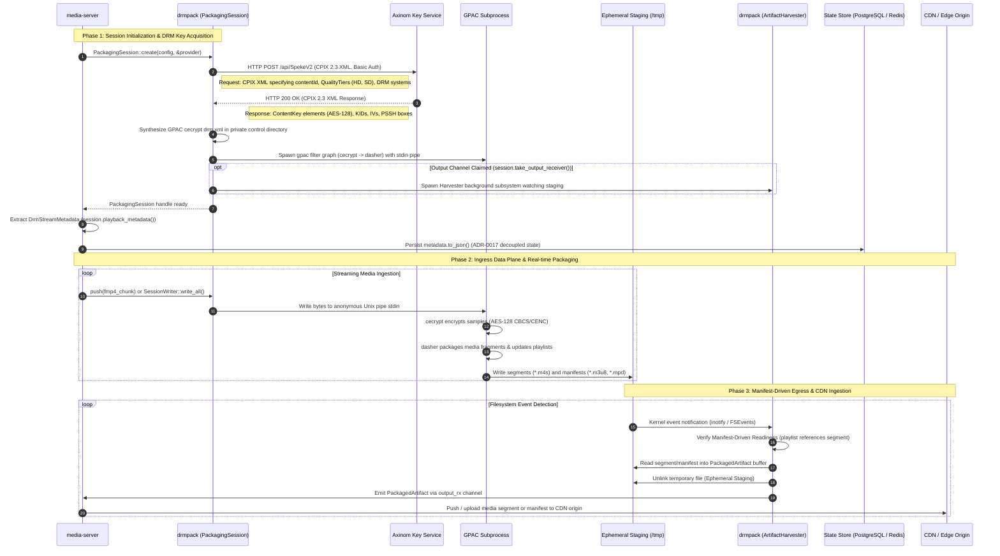
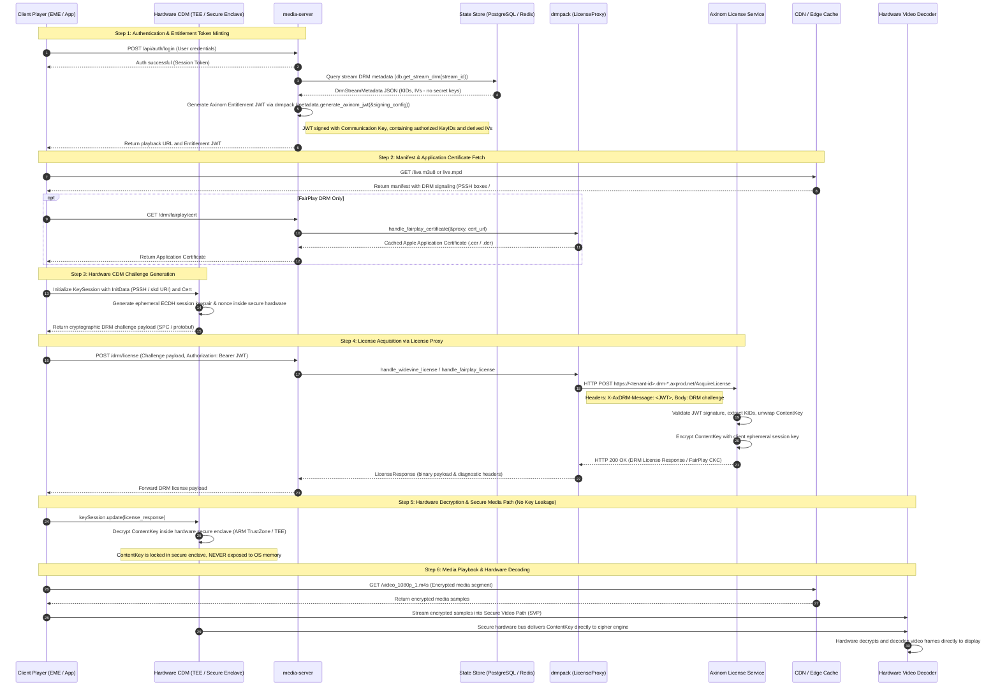

# drmpack

[](https://github.com/ermisnetwork/drmpack/actions/workflows/ci.yml)
[](https://github.com/ermisnetwork/drmpack/actions/workflows/drm-e2e.yml)
[](https://ermisnetwork.github.io/drmpack/)
[](ROADMAP.md)
[](#license)

Native Rust DRM packaging and manifest generation library orchestrating GPAC filters for CENC/CBCS fMP4 and HLS/DASH delivery.

## Overview

`drmpack` is an in-process packaging orchestrator designed for high-throughput media servers (such as `media-server`). It accepts multiplexed fragmented MP4 (fMP4) streams in memory, pipes them directly into GPAC filter graphs over anonymous Unix pipes, and emits encrypted CMAF segments and playlists via an asynchronous in-memory channel.

In addition to real-time live streaming, `drmpack` provides standalone whole-file VOD batch packaging (`drmpack::vod`) for static media files, generating DRM-encrypted DASH and HLS assets with Single-File Byte-Range (`profile=onDemand`) and Discrete Multi-Segment modes.

By piping media ingress directly into memory pipes and using ephemeral staging with immediate harvesting on egress ([ADR-0015](docs/adr/0015-direct-output-channel-and-safe-storage.md)), `drmpack` minimizes disk wear, reduces segment-to-manifest latency to sub-second ranges, and guarantees synchronization between media segments and manifest updates.

## Architecture

`drmpack` separates operations into a control plane and a data plane:

### Control Plane

- Key Acquisition: Fetches content keys, key IDs (KIDs), and PSSH metadata at session initialization using pluggable key providers.
- Configuration Generation: Dynamically synthesizes GPAC `cecrypt` XML definitions mapping track IDs to cryptographic keys, initialization vectors (IVs), and DRM system signaling.
- Process Supervision: Launches and monitors GPAC worker subprocesses via `tokio::process::Command`, capturing stderr in background tasks and providing fail-fast detection of process crashes.

### Data Plane

- Media Ingress: Pushes raw fMP4 chunks into GPAC's standard input pipe through `PackagingSession::push()` or `SessionWriter` (an adapter implementing `tokio::io::AsyncWrite`).
- Media Egress: Supports two pluggable delivery strategies via `EgressMode`:
  - `EgressMode::FileSystemStaging` (default): `ArtifactHarvester` detects finished segments and updated manifests from ephemeral staging using kernel filesystem events (`inotify`/`FSEvents`), delivering `PackagedArtifact` items through a bounded asynchronous channel.
  - `EgressMode::HttpPush`: GPAC streams segments directly over in-process HTTP loopback push (`httpout:hmode=push`) into RAM, completely eliminating disk staging for live streams.
- Manifest-Driven Readiness: In `FileSystemStaging` mode, emits media segments only after GPAC has completely flushed the segment and referenced it in the manifest, eliminating partial-read race conditions for downstream edge handlers. In `HttpPush` mode, segments are validated via ISOBMFF box parsing upon arrival.
- VOD Batch Packaging: Executes whole-file static packaging through `package_vod_file` (`drmpack::vod`), transforming local MP4 containers or separate track files into encrypted DASH and HLS assets with `#EXT-X-ENDLIST` and static timelines.

```
+-------------------------------------------------------------------------------+
|                                 media-server                                  |
|                                                                               |
|  +--------------------+                     +------------------------------+  |
|  | Input fMP4 Stream  |                     | Downstream Edge / CDN Serv   |  |
|  +---------+----------+                     +--------------^---------------+  |
|            |                                               |                  |
+------------|-----------------------------------------------|------------------+
             |                                               |
             | push() / SessionWriter                        | PackagedArtifact
             v                                               | (output_rx)
+------------+-----------------------------------------------+------------------+
| drmpack                                                                       |
|                                                                               |
|  +--------------------+        +---------------------+                        |
|  | KeyProvider        |        | ProcessSupervisor   |                        |
|  | (Axinom/CPIX/Raw)  |        | (stderr/crash/exit) |                        |
|  +---------+----------+        +----------+----------+                        |
|            |                              |                                   |
|            | KeySet / XML                 |                                   |
|            v                              v                                   |
|  +---------------------------------------------------+                        |
|  | GPAC Subprocess (cecrypt -> dasher filter graph)   |                        |
|  +-------------------------+-------------------------+                        |
|                            |                                                  |
|                            v writes segments & manifests                      |
|  +---------------------------------------------------+                        |
|  | Ephemeral Storage Staging (/tmp or tmpfs)         |                        |
|  +-------------------------+-------------------------+                        |
|                            |                                                  |
|                            v inotify / FSEvents                               |
|  +---------------------------------------------------+                        |
|  | ArtifactHarvester (Manifest-Driven Readiness)     |                        |
|  +---------------------------------------------------+                        |
+-------------------------------------------------------------------------------+
```

### Packaging and Ingestion Data Flow

The following sequence diagram illustrates the lifecycle of a packaging session, key acquisition from Axinom Key Service, live fMP4 ingestion through anonymous Unix pipes, and manifest-driven artifact delivery to `media-server` for CDN distribution:



#### Detailed Packaging Flow Breakdown

| Step | Component | Description |
| :--- | :--- | :--- |
| **1** | `media-server` | Calls `PackagingSession::create(config, &provider)` declaring stream renditions, latency mode (`Standard` or `LowLatency`), and encryption scheme (`Cbcs`, `Cenc`, or `Dual`). |
| **2 - 3** | `drmpack` & Axinom Key Service | `drmpack` constructs a DASH-IF CPIX 2.3 XML request (`<cpix:CPIX>`) specifying `contentId`, quality tiers, and target DRM systems, dispatched over HTTP POST with Basic Auth to Axinom's SPEKE v2 tenant endpoint. Axinom returns an XML response containing AES-128 ContentKeys, KIDs, IVs, and PSSH boxes. |
| **4** | `drmpack` Control Plane | Generates a private `drm.xml` mapping 1-based ISO-BMFF track IDs to ContentKeys and PSSH metadata for GPAC's `cecrypt` filter. |
| **5 - 6** | GPAC & Harvester Spawning | Spawns the `gpac` child process with stdin filter (`-i stdin:ext=mp4:alltk:...`) connected to `stdin` pipe. The artifact harvester task is spawned lazily if the caller claims `session.take_output_receiver()`. |
| **7 - 8** | Metadata Persistence | `media-server` retrieves `session.playback_metadata()` (`DrmStreamMetadata`) and persists the JSON string into PostgreSQL or Redis ([ADR-0017](docs/adr/0017-drm-playback-metadata-handoff-and-credentials.md)), decoupling packaging from playback authorization. |
| **9 - 13** | Media Ingress & Encryption | `media-server` streams muxed fMP4 chunks via `session.push()` or `SessionWriter`. Bytes flow into GPAC's stdin pipe without disk I/O. The `cecrypt` filter encrypts media samples, and `dasher` writes packaged `.m4s` segments and playlists into staging. |
| **14 - 19** | Manifest-Driven Harvesting & CDN Delivery | `ArtifactHarvester` detects writes via `inotify`/`FSEvents`. It guarantees **Manifest-Driven Readiness**: a media segment is only read after GPAC has updated the `.m3u8` manifest referencing it. Staging files are ingested into memory and immediately unlinked. `media-server` receives `PackagedArtifact` items over the async channel and forwards them to the CDN or HTTP edge cache. |

### Playback and DRM License Acquisition Flow

The following sequence diagram details end-to-end user authentication, manifest retrieval, DRM challenge creation inside hardware Content Decryption Modules (CDM), license proxying through `drmpack`, and direct hardware video decoding in isolated memory:



#### Detailed Playback and Decryption Flow Breakdown

| Step | Entity | Description |
| :--- | :--- | :--- |
| **1 - 4** | Authentication & Token Minting | The client authenticates with `media-server`. `media-server` queries PostgreSQL or Redis for `DrmStreamMetadata` persisted during packaging ([ADR-0017](docs/adr/0017-drm-playback-metadata-handoff-and-credentials.md)). Using `drmpack::vendor::axinom::AxinomSigningConfig` and `metadata.generate_axinom_jwt(&signing_config)`, `media-server` mints an Axinom DRM entitlement JWT containing authorized KeyIDs and derived IVs. The token is delivered to the client player. |
| **5 - 8** | Manifest & Certificate Retrieval | The player fetches the streaming manifest (`live.m3u8` or `live.mpd`) from CDN edge cache. For Apple FairPlay on iOS/Safari, the player requests the Apple Application Certificate (`.cer` / `.der`), served by `media-server` via `drmpack::license::handle_fairplay_certificate` with in-memory caching. |
| **9 - 11** | Hardware CDM Challenge Generation | The player invokes the browser Encrypted Media Extensions (EME) or iOS `AVContentKeySession`, passing the initialization data (PSSH box or `skd://` URI). Inside the isolated hardware Content Decryption Module (Google Widevine L1/L3, Apple FairPlay Core, Microsoft PlayReady SL3000), an ephemeral session keypair is generated, producing a cryptographic DRM challenge payload (SPC for FairPlay, protobuf for Widevine). |
| **12 - 17** | License Proxying via `drmpack` | The player submits the challenge along with the entitlement JWT to `media-server`. `media-server` invokes `drmpack::license::handle_widevine_license()` or `handle_fairplay_license()`. The `LicenseProxy` forwards the request with header `X-AxDRM-Message: <JWT>` to the tenant's Axinom License Service. Axinom verifies the JWT, unwraps the ContentKey, encrypts it with the client's ephemeral session key, and returns the encrypted license payload. Upstream diagnostic headers (`X-AxDRM-ErrorMessage`) are surfaced upon rejection. |
| **18 - 20** | Hardware Decryption (Secure Enclave / TEE) | The player feeds the license response to the CDM (`keySession.update()`). The CDM unwraps the ContentKey **strictly inside hardware secure memory** (ARM TrustZone, Apple Secure Enclave, or Windows Secure Media Path). The raw AES-128 key is **never exposed to application RAM or operating system userspace**. |
| **21 - 25** | Media Fetch & Hardware Decoding | The player fetches encrypted media segments (`.m4s`) from CDN. Encrypted sample buffers are routed directly to the Hardware Video Decoder (Secure Video Path). The CDM provides the ContentKey directly over an internal hardware bus, decrypting and displaying video frames on screen with full cryptographic isolation. |

`drmpack` officially supports and is production-tested with **Axinom DRM**:

- Key Service Integration: Acquired via `AxinomProvider` utilizing AWS SPEKE v2 wire protocol over DASH-IF CPIX 2.3 XML payloads with tenant-specific API endpoints and Basic authentication.
- Key Configuration: Supports key ID overrides, multi-tier keys (SD, HD, 4K), and simultaneous dual-scheme key mapping (CENC + CBCS).
- License Acquisition Proxies: Dedicated handlers for Widevine, FairPlay, and PlayReady license challenges, returning upstream vendor diagnostic headers (`X-AxDRM-ErrorMessage`).
- Entitlement Token Generation: Secure generation and signing of Axinom JWT entitlement tokens via `AxinomSigningConfig` using communication key IDs and secrets.

In addition to Axinom, `drmpack` provides:
- DASH-IF CPIX 2.3: Standardized CPIX client (`CpixProvider`) over HTTP POST.
- AWS SPEKE v2: Generic SPEKE client (`SpekeClient` / `SpekeV2Provider`) supporting custom authorization headers and AWS SigV4 request signing.
- Static Key Source (`StaticKeySource` / `RawKeyProvider`): In-memory key store for offline packaging, unit testing, and continuous integration without network dependencies.

## System Prerequisites

To use `drmpack`, the host environment must meet the following requirements:

### 1. GPAC CLI (>= 2.2 required)

`drmpack` orchestrates native GPAC filter graphs over anonymous Unix pipes. The `gpac` executable must be installed and accessible in the system `PATH` (or configured via `PackagingSessionConfig::with_gpac_bin()`).

#### Installation by Platform

- **Ubuntu 24.04 LTS (`noble`):**
  ```bash
  sudo apt-get update && sudo apt-get install -y gpac
  ```
  *(Requires `universe` component enabled. Provides GPAC 2.2+).*

- **Official GPAC APT Repository (Ubuntu 22.04+, Debian 11/12):**
  *Ubuntu 22.04 default repos only have GPAC 2.0 (too old), and Debian 12 has no GPAC package in official repos. Use the official GPAC repository:*
  ```bash
  sudo apt-get update && sudo apt-get install -y ca-certificates curl
  sudo install -m 0755 -d /etc/apt/keyrings
  sudo curl -fsSL https://dist.gpac.io/gpac/linux/gpg.asc -o /etc/apt/keyrings/gpac.asc
  sudo chmod a+r /etc/apt/keyrings/gpac.asc

  sudo tee /etc/apt/sources.list.d/gpac.sources <<EOF
  Types: deb
  URIs: https://dist.gpac.io/gpac/linux/$(. /etc/os-release && echo "$ID")
  Suites: $(. /etc/os-release && echo "${UBUNTU_CODENAME:-$VERSION_CODENAME}")
  Components: main
  Signed-By: /etc/apt/keyrings/gpac.asc
  EOF

  sudo apt-get update && sudo apt-get install -y gpac
  ```

- **macOS (Homebrew):**
  ```bash
  brew install gpac
  ```

- **Alpine Linux:**
  GPAC is not packaged in Alpine's apk repositories. For Alpine-based containers, compile from source or copy pre-built binaries from a multi-stage builder.

- **Building from Source (Universal Linux):**
  ```bash
  # 1. Install build dependencies
  sudo apt-get update && sudo apt-get install -y \
      build-essential git pkg-config zlib1g-dev libssl-dev

  # 2. Clone and build GPAC (latest stable release, e.g. v26.07.0 or >= 2.2)
  git clone https://github.com/gpac/gpac.git
  cd gpac
  git checkout v26.07.0
  ./configure --prefix=/usr/local --use-ffmpeg=no
  make -j$(nproc)
  sudo make install
  sudo ldconfig
  ```

- **Docker Production Image (Ubuntu 24.04 Example):**
  ```dockerfile
  FROM rust:1.80-bookworm AS builder
  WORKDIR /build
  COPY . .
  RUN cargo build --release

  FROM ubuntu:24.04
  RUN apt-get update && apt-get install -y --no-install-recommends \
      gpac \
      ca-certificates \
      && rm -rf /var/lib/apt/lists/*
  COPY --from=builder /build/target/release/your_service /usr/local/bin/
  ENTRYPOINT ["your_service"]
  ```

#### Verifying GPAC Installation

Confirm the installed version and ensure that essential filter modules are enabled:

```bash
# 1. Verify executable and version (>= 2.2)
gpac -version

# 2. Verify required filter modules are available
gpac -h cecrypt   # CENC/CBCS DRM encryption filter
gpac -h dasher    # DASH & HLS segmentation engine
gpac -h mp4dmx    # MP4 demultiplexer
```

#### Custom GPAC Binary Path

If `gpac` is installed in a non-standard location or container mount point, specify the binary path programmatically in `PackagingSessionConfig`:

```rust
use drmpack::session::PackagingSessionConfig;

let config = PackagingSessionConfig::new("live-session")
    .with_gpac_bin("/usr/local/bin/gpac"); // Defaults to "gpac" in PATH
```

### 2. Media Egress Delivery Modes (`EgressMode`)

`drmpack` supports two delivery staging strategies configured via `.with_egress_mode(...)`:

#### `EgressMode::FileSystemStaging` (Default)
Writes low-latency CMAF media segments and manifests into an ephemeral staging directory (`std::env::temp_dir()`, typically `/tmp` on Linux or `$TMPDIR` on macOS) before `ArtifactHarvester` reads them into memory channels and unlinks them:
- **Linux & Containers (Production):** Standard temporary directory `/tmp` backed by local disk or NVMe SSD. Linux automatically leverages the **kernel Page Cache** for sub-millisecond RAM write/read speeds (35–80µs) with zero physical disk I/O when files are purged promptly ([ADR-0015](docs/adr/0015-direct-output-channel-and-safe-storage.md)).
- **Optional Ramdisk (Opt-in):** If you explicitly provision `/dev/shm` or tmpfs with verified memory headroom, configure `.with_output_dir("/dev/shm/...")`.

#### `EgressMode::HttpPush` (Zero-Disk In-Process HTTP Egress)
GPAC pushes packaged segments and playlists directly via HTTP `PUT` requests to an internal loopback server (`HttpEgressServer`) listening on an ephemeral localhost port (`127.0.0.1:0`) with UUID token authentication:
- **Zero Disk Footprint:** Segments and manifests are streamed directly into `output_rx: mpsc::Receiver<PackagedArtifact>` in memory without touching the filesystem.
- **Dual Scheme Routing:** Automatically routes `/cbcs/` and `/cenc/` partitions for concurrent Dual packaging sessions.

```rust
use drmpack::types::EgressMode;
use drmpack::session::PackagingSessionConfig;

// Default: FileSystemStaging backed by Linux Page Cache
let config = PackagingSessionConfig::new("live-session");

// Opt-in: Zero-disk in-memory HTTP egress
let http_config = PackagingSessionConfig::new("live-session")
    .with_egress_mode(EgressMode::HttpPush);
```


## Environment Configuration

When integrating with commercial DRM vendors (such as Axinom), configure the required credentials via environment variables or an application configuration file:

```bash
# ==============================================================================
# Axinom Key Service (SPEKE v2 over CPIX 2.3)
# ==============================================================================
AXINOM_TENANT_ID="your-tenant-id-uuid"
AXINOM_MANAGEMENT_KEY="your-axinom-management-key"
AXINOM_ENDPOINT="https://<tenant-id>.key-service-management.axprod.net/api/SpekeV2"
AXINOM_OVERRIDE_KEY_IDS="false"

# ==============================================================================
# Axinom Communication Keys (JWT Entitlement Tokens)
# ==============================================================================
AXINOM_COMMUNICATION_KEY_ID="your-communication-key-id-uuid"
AXINOM_COMMUNICATION_KEY="your-base64-communication-secret"

# ==============================================================================
# Axinom License Services (Widevine, FairPlay, PlayReady)
# ==============================================================================
AXINOM_WIDEVINE_LICENSE_URL="https://<tenant-id>.drm-widevine-licensing.axprod.net/AcquireLicense"
AXINOM_FAIRPLAY_LICENSE_URL="https://<tenant-id>.drm-fairplay-licensing.axprod.net/AcquireLicense"
AXINOM_PLAYREADY_LICENSE_URL="https://<tenant-id>.drm-playready-licensing.axprod.net/AcquireLicense"

# Optional: Apple FairPlay Application Certificate URL (.cer / .der)
AXINOM_FAIRPLAY_CERT_URL="https://your-cdn.example.com/fairplay.cer"
```

## Installation

Add `drmpack` as a dependency in your `Cargo.toml`.

### 1. Git Release Tag (Recommended for Downstream Services)

To ensure reproducible builds and avoid unexpected breaking changes from in-flight development commits, pin to a specific release tag:

```toml
[dependencies]
drmpack = { git = "https://github.com/ermisnetwork/drmpack.git", tag = "v0.1.1" }
```

> [!NOTE]
> Tracking the development branch directly (`branch = "main"`) is suitable only for exploratory work. In production, always pin `tag` or `rev`.

### 2. Local Path Dependency (Development / Monorepo)

When developing alongside `media-server` in a local workspace:

```toml
[dependencies]
drmpack = { path = "../drmpack" }
```

> [!IMPORTANT]
> **Runtime Prerequisite**: `drmpack` orchestrates native GPAC filter graphs. Any service or Docker container importing `drmpack` must have the `gpac` executable (>= 2.2 / 26.07) installed in its host environment or container image (see [System Prerequisites](#system-prerequisites)).

### Feature Flags

All enterprise DRM features (`axinom`, `speke-v2`, `cpix`, `license-proxy`) are **enabled by default**. The standard import provides out-of-the-box integration for Axinom Key Service, SPEKE v2, and DRM license proxying:

```toml
[dependencies]
drmpack = { git = "https://github.com/ermisnetwork/drmpack.git", tag = "v0.1.1" }
```

| Feature Flag | Default | Description |
| :--- | :--- | :--- |
| `cpix` | **Yes** | DASH-IF CPIX 2.3 request builder, response parser, and `CpixProvider`. |
| `speke-v2` | **Yes** | AWS SPEKE v2 wire client (`SpekeClient`) with SigV4 and token authentication. |
| `axinom` | **Yes** | Axinom Key Service provider, signing utilities, and token generator. |
| `license-proxy` | **Yes** | In-process DRM license proxy client, handlers, and FairPlay cert cache. |

> [!TIP]
> **Minimal Build (`default-features = false`)**: If your pipeline uses static/pre-shared keys (via `StaticKeySource` or raw keys) and does not call remote key servers, you can disable default features to strip HTTP client (`reqwest`), XML parser, and crypto (`ring`) dependencies for faster build times and smaller binary footprints:
>
> ```toml
> [dependencies]
> drmpack = { git = "https://github.com/ermisnetwork/drmpack.git", tag = "v0.1.1", default-features = false }
> ```

## Documentation

While `drmpack` is not yet published to crates.io, full API documentation can be accessed in two ways:

1. **Online via GitHub Pages:**
   Every push to `main` automatically builds and deploys continuous API documentation to GitHub Pages:
   👉 **[https://ermisnetwork.github.io/drmpack/](https://ermisnetwork.github.io/drmpack/)**

2. **Local Generation via rustdoc:**
   Generate and browse the documentation locally in your browser:
   ```bash
   cargo doc --all-features --no-deps --open
   ```
   The generated HTML entrypoint is located at `target/doc/drmpack/index.html`.


## Quick Start Integration

### 1. Setting Up an In-Memory Session with Static Keys

Useful for local development and automated integration testing without external DRM server access:

```rust,no_run
use drmpack::key::StaticKeySource;
use drmpack::session::{PackagingSession, PackagingSessionConfig};
use drmpack::types::{EncryptionScheme, LatencyMode, Rendition};

#[tokio::main]
async fn main() -> Result<(), Box<dyn std::error::Error>> {
    // 1. Configure pre-shared 128-bit ContentKey
    let key = [0x55; 16];
    let provider = StaticKeySource::shared_key(key);

    // 2. Define packaging configuration (CBCS, Standard Latency, 2-second segments)
    let config = PackagingSessionConfig::new("live_stream_01")
        .with_encryption_scheme(EncryptionScheme::Cbcs)
        .with_latency_mode(LatencyMode::Standard)
        .with_segment_duration(2.0)
        .with_rendition(Rendition::video_hd())
        .with_rendition(Rendition::audio());

    // 3. Initialize packaging session (launches GPAC subprocess)
    let mut session = PackagingSession::create(config, &provider).await?;

    // 4. Ingest media bytes
    // session.push(fmp4_chunk_bytes).await?;

    // 5. Finalize session cleanly
    session.close().await?;
    Ok(())
}
```

### 2. Live Packaging with Axinom DRM

Connects to Axinom's Key Service, fetches multi-tier keys via SPEKE v2/CPIX, and sets up packaging:

```rust,no_run
use drmpack::axinom::{AxinomConfig, AxinomProvider};
use drmpack::session::{PackagingSession, PackagingSessionConfig};
use drmpack::types::{EncryptionScheme, LatencyMode, Rendition};

#[tokio::main]
async fn main() -> Result<(), Box<dyn std::error::Error>> {
    // Load credentials from environment
    let axinom_config = AxinomConfig::from_env()?;
    let provider = AxinomProvider::new(axinom_config);

    // Configure live session
    let session_config = PackagingSessionConfig::new("stream_channel_01")
        .with_encryption_scheme(EncryptionScheme::Cbcs)
        .with_latency_mode(LatencyMode::Standard)
        .with_segment_duration(2.0)
        .with_rendition(Rendition::video_hd())
        .with_rendition(Rendition::audio())
        .with_all_drm();

    let mut session = PackagingSession::create(session_config, &provider).await?;

    // Retrieve public playback metadata (DrmStreamMetadata)
    let metadata = session.playback_metadata();
    println!("Stream Content Keys initialized: {}", metadata.keys.len());

    // =========================================================================
    // PRODUCTION PERSISTENCE (ADR-0017):
    // In production (e.g. Ermis Stream), serialize metadata to PostgreSQL/Redis
    // so decoupled playback token services can mint entitlement JWTs on demand:
    // =========================================================================
    let meta_json = metadata.to_json()?;
    // db.save_stream_drm(&content_id, &meta_json).await?;

    session.close().await?;
    Ok(())
}
```

> [!IMPORTANT]
> **Production State Persistence ([ADR-0017](docs/adr/0017-drm-playback-metadata-handoff-and-credentials.md)):**
> In a production deployment (e.g. Ermis Stream), the packaging service serializes `session.playback_metadata()` into PostgreSQL or Redis:
> ```rust
> let meta = session.playback_metadata();
> db.save_stream_drm(&content_id, &meta.to_json()?).await?;
> ```
> The playback authorization backend retrieves this metadata (`DrmStreamMetadata::from_json(&meta_json)?`) to mint DRM entitlement tokens (Axinom JWTs) containing authorized KeyIDs and derived IVs.
> 
> `DrmStreamMetadata` intentionally excludes raw AES secret keys (`key: [u8; 16]`) to eliminate the risk of credential leakage across service boundaries.

#### `DrmStreamMetadata` Schema & Serialization

[`DrmStreamMetadata`](src/session/metadata.rs) carries the public key configuration needed by playback services, strictly omitting private cryptographic key material:

```rust
pub struct DrmStreamMetadata {
    /// Content or stream identifier string (e.g. "stream_channel_01")
    pub content_id: String,
    /// Packaging encryption mode (Cbcs, Cenc, or Dual)
    pub scheme: EncryptionScheme,
    /// Public key entries for tracks and quality tiers
    pub keys: Vec<DrmKeyEntry>,
}

pub struct DrmKeyEntry {
    /// Associated KeyID (UUID)
    pub kid: KeyID,
    /// Concrete encryption scheme for this key (Cbcs or Cenc)
    pub scheme: EncryptionScheme,
    /// Elementary track type (Video or Audio)
    pub track_type: TrackType,
    /// Associated quality tier (e.g. SD, HD, UHD, AUDIO)
    pub quality_tier: QualityTier,
    /// Optional 128-bit initialization vector (omitted when None)
    pub iv: Option<[u8; 16]>,
}
```

**Example Serialized JSON (`metadata.to_json_pretty()`):**

```json
{
  "content_id": "stream_channel_01",
  "scheme": "cbcs",
  "keys": [
    {
      "kid": "00000000-0000-0000-0000-000000000001",
      "scheme": "cbcs",
      "track_type": "video",
      "quality_tier": "HD",
      "iv": [0, 0, 0, 0, 0, 0, 0, 0, 0, 0, 0, 0, 0, 0, 0, 1]
    },
    {
      "kid": "00000000-0000-0000-0000-000000000002",
      "scheme": "cbcs",
      "track_type": "audio",
      "quality_tier": "AUDIO",
      "iv": [0, 0, 0, 0, 0, 0, 0, 0, 0, 0, 0, 0, 0, 0, 0, 2]
    }
  ]
}
```

### 3. Ingesting Media via push() or SessionWriter

`drmpack` provides two ingestion methods:

- `session.push(bytes)`: Primary async ingestion method accepting any byte slice or buffer implementing `AsRef<[u8]>` (`&[u8]`, `Vec<u8>`, `bytes::Bytes`).
- `session.writer()`: Secondary adapter returning an owned `SessionWriter` implementing `tokio::io::AsyncWrite`, ideal for `tokio::io::copy` or direct I/O pipe integration.

```rust,no_run
use drmpack::session::PackagingSession;
use tokio::io::AsyncReadExt;

async fn ingest(
    session: &mut PackagingSession,
    mut source_socket: tokio::net::TcpStream,
) -> Result<(), Box<dyn std::error::Error>> {
    let mut buffer = vec![0u8; 64 * 1024];

    // Read incoming fMP4 chunks and push directly into packaging session
    loop {
        let n = source_socket.read(&mut buffer).await?;
        if n == 0 {
            break;
        }
        session.push(&buffer[..n]).await?;
    }

    Ok(())
}
```

Alternatively, when streaming directly between reader and writer interfaces via `tokio::io::copy`, use `session.writer()`:

```rust,no_run
use drmpack::session::PackagingSession;

async fn ingest_with_writer(
    session: &mut PackagingSession,
    mut source_socket: tokio::net::TcpStream,
) -> Result<(), Box<dyn std::error::Error>> {
    let mut writer = session.writer();
    tokio::io::copy(&mut source_socket, &mut writer).await?;
    writer.close().await;
    Ok(())
}
```

### 4. Consuming Packaged Artifacts

Consume encrypted segments (`.m4s`), initialization files (`<tier>_init.mp4`), and playlists (`.m3u8`, `.mpd`) directly from the bounded output receiver channel:

```rust,no_run
use drmpack::session::PackagingSession;
use drmpack::types::ArtifactKind;

async fn consume_artifacts(mut session: PackagingSession) {
    if let Some(mut rx) = session.take_output_receiver() {
        tokio::spawn(async move {
            while let Some(artifact) = rx.recv().await {
                match artifact.kind {
                    ArtifactKind::Manifest => {
                        println!("Updated playlist: {} ({} bytes)", artifact.filename, artifact.data.len());
                    }
                    ArtifactKind::MediaSegment => {
                        println!("New segment ready: {} [scheme: {}]", artifact.filename, artifact.scheme);
                    }
                    ArtifactKind::InitSegment => {
                        println!("Init segment ready: {}", artifact.filename);
                    }
                }
            }
        });
    }
}
```

### 5. Mounting DRM License Proxy Routes (Axum Example)

Forward client DRM challenges to Axinom or commercial DRM license servers:

```rust,no_run
use axum::{body::Bytes, extract::State, http::HeaderMap, response::IntoResponse, routing::post, Router};
use drmpack::license::{handle_widevine_license, LicenseProxy, LicenseProxyConfig};
use std::sync::Arc;

struct AppState {
    proxy: LicenseProxy,
}

async fn widevine_handler(
    State(state): State<Arc<AppState>>,
    headers: HeaderMap,
    body: Bytes,
) -> impl IntoResponse {
    let auth_token = headers.get("authorization").and_then(|v| v.to_str().ok()).unwrap_or("");
    match handle_widevine_license(&state.proxy, body, auth_token).await {
        Ok(res) => (axum::http::StatusCode::OK, res.data).into_response(),
        Err(err) => (axum::http::StatusCode::BAD_REQUEST, err.to_string()).into_response(),
    }
}

pub fn make_license_router(config: LicenseProxyConfig) -> Router {
    let state = Arc::new(AppState {
        proxy: LicenseProxy::new(config),
    });

    Router::new()
        .route("/drm/widevine", post(widevine_handler))
        .with_state(state)
}
```

### 6. Minting Playback Entitlement Tokens (Axinom JWT)

When a client player authenticates, the playback authorization service fetches the stream's `DrmStreamMetadata` from state storage (PostgreSQL/Redis) and mints an entitlement JWT with authorized KIDs and derived IVs:

```rust,no_run
use drmpack::axinom::AxinomSigningConfig;
use drmpack::session::DrmStreamMetadata;

async fn mint_playback_token(
    stream_id: &str,
    signing_config: &AxinomSigningConfig,
) -> Result<String, Box<dyn std::error::Error>> {
    // 1. Fetch metadata JSON stored during packaging session initialization (ADR-0017)
    // let meta_json = db.get_stream_drm(stream_id).await?;
    let meta_json = r#"{"content_id":"...","scheme":"cbcs","keys":[...]}"#;

    // 2. Deserialize into DrmStreamMetadata
    let metadata = DrmStreamMetadata::from_json(meta_json)?;

    // 3. Mint signed Axinom entitlement JWT (contains authorized KIDs & derived IVs)
    let token = metadata.generate_axinom_jwt(signing_config)?;

    Ok(token)
}
```

### 7. VOD Whole-File Batch Packaging (`drmpack::vod`)

For static files and on-demand video libraries, `drmpack::vod` provides a standalone batch packaging API decoupled from real-time live streaming sessions. It executes whole-file packaging of MP4 inputs into DRM-protected DASH (`.mpd`) and HLS (`.m3u8`) static assets.

#### Packaging Delivery Modes (`VodMode`)
- **`VodMode::SingleFile` (Default / On-Demand Byte-Range)**: Generates a single self-initializing `.mp4` container per rendition containing an `sidx` box, `#EXT-X-BYTERANGE` tags in HLS playlists, and `<SegmentBase>` in DASH manifests. Aligns with Apple HLS byte-range and DASH-IF On-Demand profiles, reducing CDN origin storage file counts by over 99% compared to discrete chunked storage.
- **`VodMode::Segmented` (Discrete Multi-Segment)**: Emits an initialization fragment (`<tier>_init.mp4`) and discrete `.m4s` media segment files per rendition for traditional chunked CDN storage topologies.

#### Flexible Input Sources (`VodInputSource`)
- **`VodInputSource::SingleFile(path)`**: A single multiplexed MP4 container containing multiple video, audio, or subtitle tracks. Use `rendition.with_container_track_id(track_id)` to map declared renditions to container tracks.
- **`VodInputSource::TrackFiles(vec![path1, path2])`**: Separate media files per rendition (e.g., dedicated video and audio tracks).

#### Example: Packaging a VOD Asset with `package_vod_file`

```rust,no_run
use drmpack::key::{ContentKey, StaticKeySource};
use drmpack::types::{DrmSystem, EncryptionScheme, QualityTier, Rendition, TrackType};
use drmpack::vod::{package_vod_file, VodInputSource, VodMode, VodPackageConfig};
use std::path::PathBuf;
use std::sync::Arc;
use uuid::Uuid;

#[tokio::main]
async fn main() -> Result<(), Box<dyn std::error::Error>> {
    // 1. Configure key provider (StaticKeySource or AxinomProvider)
    let video_kid = Uuid::new_v4();
    let video_key = ContentKey::new(video_kid, [0xaa; 16], QualityTier::hd(), TrackType::Video);
    let key_provider = Arc::new(StaticKeySource::new().with_key(video_key));

    // 2. Configure VOD batch packaging (SingleFile byte-range onDemand)
    let config = VodPackageConfig::new(
        "movie_demo_01",
        VodInputSource::SingleFile(PathBuf::from("scratch/sample.mp4")),
        PathBuf::from("scratch/vod_output"),
    )
    .with_vod_mode(VodMode::SingleFile)
    .with_encryption_scheme(EncryptionScheme::Cbcs)
    .with_drm_system(DrmSystem::FairPlay)
    .with_drm_system(DrmSystem::Widevine)
    .with_rendition(Rendition::video_hd().with_container_track_id(1))
    .with_rendition(Rendition::audio().with_container_track_id(2).clear());

    // 3. Execute whole-file packaging
    let result = package_vod_file(&config, &key_provider).await?;

    println!("DASH MPD: {}", result.mpd_manifest.display());
    if let Some(ref master) = result.master_playlist {
        println!("HLS Master: {}", master.display());
    }
    println!("Media Files: {:?}", result.media_files);
    Ok(())
}
```

### 8. Runnable Examples

The `examples/` directory contains end-to-end runnable pipelines demonstrating drmpack capabilities:

| Example | Description | Run Command |
| :--- | :--- | :--- |
| `08_in_memory_live_stream` | Live packaging pipeline via filesystem staging (`EgressMode::FileSystemStaging`) with FFmpeg and latency metrics. | `cargo run --example 08_in_memory_live_stream -- --static --duration 15` |
| `09_axum_playback_server` | Standalone Axum playback server with Shaka Player and Axinom DRM token generation. | `cargo run --example 09_axum_playback_server -- --stream-dir scratch/example08_stream` |
| `10_http_output_live_stream` | **Zero-disk HTTP egress** live packaging pipeline (`EgressMode::HttpPush`), streaming media segments directly over in-process HTTP into RAM. | `cargo run --example 10_http_output_live_stream -- --dual --static --duration 15` |
| `11_http_output_playback_server` | Standalone playback server serving HTTP egress stream dump with Axinom & ClearKey DRM and Shaka Player Web UI. | `cargo run --example 11_http_output_playback_server -- --port 8080` |
| `12_vod_batch_packaging` | Standalone whole-file VOD batch packaging example into DRM-protected DASH and HLS assets using Single-File Byte-Range mode (`profile=onDemand`). | `cargo run --example 12_vod_batch_packaging` |


## Domain Glossary

Key terminology used throughout `drmpack` (aligned with `CONTEXT.md`):

- **PackagingSession**: The core controller managing key acquisition, GPAC subprocess lifecycle, and manifest delivery.
- **SessionWriter**: An owned write handle implementing `tokio::io::AsyncWrite`, created via `PackagingSession::writer()`.
- **Rendition**: A declared track configuration bound to a `QualityTier` for DRM key association.
- **QualityTier**: A named group of Renditions sharing a single `ContentKey` (e.g., SD, HD, 4K, AUDIO).
- **EncryptionScheme**: Concrete cipher mode — `cbcs` (AES-CBC 1:9, production default), `cenc` (AES-CTR), or `dual` (both simultaneously).
- **LatencyMode**: Streaming delivery latency profile — `Standard` (canonical default, 2-6s segments) or `LowLatency` (CMAF chunking 200-500ms, LL-HLS, LL-DASH).
- **PackagedArtifact**: Structured container carrying an encrypted media segment or updated manifest emitted directly through the output channel.
- **ArtifactHarvester**: Background subsystem monitoring the staging directory for completed segments and playlists using kernel filesystem events.
- **Manifest-Driven Readiness**: Synchronization guarantee ensuring a media segment is emitted to callers only after GPAC has fully written the segment and updated the manifest.
- **DrmStreamMetadata**: Public, serializable data transfer object emitted by `PackagingSession::playback_metadata()` for application-level state persistence (PostgreSQL/Redis). Encapsulates public KIDs, IVs, track bindings, and encryption schemes needed by playback authorization backends to issue DRM entitlement tokens, while strictly excluding raw AES keys to prevent leakage across service boundaries ([ADR-0017](docs/adr/0017-drm-playback-metadata-handoff-and-credentials.md)).
- **AxinomSigningConfig**: Secure credential container managing Axinom Communication Key ID and secret for minting entitlement JWTs, with redacted debug logs and direct JWT signing over `DrmStreamMetadata` ([ADR-0017](docs/adr/0017-drm-playback-metadata-handoff-and-credentials.md)).
- **package_vod_file**: Standalone batch packaging function in `drmpack::vod` executing whole-file VOD encryption and static manifest generation.
- **VodPackageConfig**: Configuration builder for VOD batch jobs specifying input sources, output directory, `VodMode`, encryption scheme, renditions, and DRM systems.
- **VodMode**: Packaging delivery profile for VOD — `SingleFile` (on-demand byte-range with `sidx` box, 1 file per rendition) or `Segmented` (discrete `.m4s` segments).
- **VodInputSource**: Input media source strategy for VOD packaging — single multiplexed container (`SingleFile`) or separate per-track files (`TrackFiles`).

## Roadmap

See [ROADMAP.md](ROADMAP.md) for the detailed development roadmap, status checklists across release milestones (v0.1.x, v0.2.0, v0.3.0, v1.0.0), and architectural non-goals.

## License

This project is licensed under either of:

- Apache License, Version 2.0 ([LICENSE-APACHE](LICENSE-APACHE) or http://www.apache.org/licenses/LICENSE-2.0)
- MIT license ([LICENSE-MIT](LICENSE-MIT) or http://opensource.org/licenses/MIT)

at your option.
