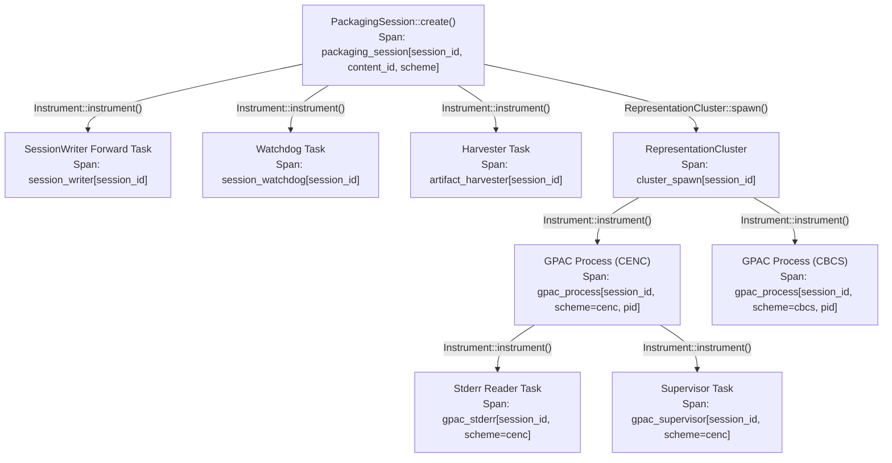

# Logging, Observability, and Error Diagnostics Architecture: Audit, Blind Spots, and Best Practices

> **Scope:** `src/error.rs`, `src/session/mod.rs`, `src/session/cluster.rs`, `src/session/harvester.rs`, `src/gpac/process.rs`, `src/key/mod.rs`, `src/key/raw.rs`, `src/speke/client.rs`, `src/vendor/axinom/provider.rs`, `src/license/proxy.rs`.  
> **Primary Sources:** ISO/IEC 23001-7 (CENC), DASH-IF CPIX 2.3, AWS SPEKE v2.0 Specification, Axinom DRM Key Service & License Proxy Docs, Rust Tracing & Tracing-Subscriber Specifications, Tokio Async Diagnostics Guidelines.  
> **Target Audience:** Systems Engineers, Media Streaming Engineers, SRE & Observability Architects.

---

## 1. Executive Summary

`drmpack` operates as a high-throughput, low-latency DRM live packaging engine bridging asynchronous Rust with GPAC C processes via anonymous pipes and memory-mapped Ramdisk storage. Because it coordinates external C binaries (`gpac`), network-bound key management servers (AWS SPEKE v2, Axinom CPIX), asynchronous disk harvesters, and real-time client license proxies, **observability and error diagnostics are mission-critical**.

An exhaustive audit of the core modules reveals that while foundational logging (`tracing`) and error structures (`DrmpackError`, `PackagingSessionFailure`) exist, the current architecture suffers from five severe systemic vulnerabilities:

1. **Context Fragmentation & Missing Tracing Spans:** Only 3 out of 10+ core source files import `tracing`. Critical asynchronous tasks (Harvester, Stderr Reader, Process Supervisor, Session Writer forwarding, Inactivity Watchdog) are spawned across `tokio::spawn` without span propagation, completely stripping `session_id`, `content_id`, `scheme`, and `track_id` from production logs.
2. **GPAC Stderr Ring Buffer Overwrite & Classification Pitfalls:** GPAC's stderr collector retains only a fixed 64-line ring buffer using `VecDeque::pop_front()`. In cascading failures, the **initial root cause error** (e.g. key mismatch, missing box) is dropped, leaving only downstream flush warnings. Furthermore, log severity classification relies on simplistic substring heuristics that yield false positives on benign paths and false negatives on actual GPAC errors.
3. **Silent Failures and Data Loss in the Harvesting Pipeline:** `Harvester::harvest_target` silently swallows directory traversal failures, file metadata read failures, and file unlink failures with `let _ = ...` or `Err(_) => return Ok(())`. Most critically, corrupted or truncated ISOBMFF segments are dropped silently without a warning, error, or metric increment, leading to silent playback stalls at the live edge.
4. **Stringly-Typed Errors & Missing Actionable Troubleshooting Hints:** Core error variants (`KeyProvider(String)`, `Encryption(String)`, `InvalidConfig(String)`, `Session(String)`, `Gpac(String)`) discard underlying source errors (`#[source]`), discard HTTP status codes, and omit machine-readable error codes. Error messages provide no actionable remediation hints for operational triage.
5. **Incomplete Diagnostic Headers & Secrets Leakage:** Diagnostic headers (`X-Speke-Error-Message`, `X-Amzn-ErrorType`, `X-Request-Id`) are missing in license proxy error responses. Most critically, `StaticKeySource` leaks raw 128-bit AES key bytes in plaintext via `#[derive(Debug)]` on `shared_fallback`, and `ContentKey` derives `serde::Serialize` without secret redaction.

---

## 2. File-by-File Audit & Architectural Blind Spots

### 2.1. `src/error.rs`
- **Stringly-Typed Error Variants ([`src/error.rs:8-22`](../../src/error.rs#L8-L22)):**
  ```rust
  #[error("Key provider error: {0}")]
  KeyProvider(String),
  #[error("Encryption error: {0}")]
  Encryption(String),
  #[error("Invalid configuration: {0}")]
  InvalidConfig(String),
  #[error("Session error: {0}")]
  Session(String),
  #[error("GPAC engine error: {0}")]
  Gpac(String),
  ```
  **Flaw:** Discards source error types (`#[from]`, `#[source]`). If `reqwest::Error` or `quick_xml::Error` caused a failure, the original error chain is collapsed into a formatted string, making programmatic downcasting (`error.downcast_ref::<reqwest::Error>()`) impossible.
- **Lack of Error Codes & Diagnostic Hints:** Errors lack machine-readable discriminants (e.g., `DRM_SPEKE_AUTH_FAILED`, `DRM_GPAC_PIPE_BROKEN`, `DRM_KEY_NOT_FOUND`). An operator receiving `KeyProvider error` cannot automate alerts or implement retry policies without fragile string matching.
- **Unstructured GPAC Crash Error ([`src/error.rs:23-27`](../../src/error.rs#L23-L27)):**
  `ProcessCrashed { exit_code: Option<i32>, stderr: String }` does not distinguish between process hang/timeout, OOM killer (`SIGKILL` / exit code 137), pipe closure (`SIGPIPE` / exit code 141), filter configuration error, or segmentation fault (`SIGSEGV` / exit code 139).
- **Session Failure String Concatenation ([`src/error.rs:149-160`](../../src/error.rs#L149-L160)):**
  `PackagingSessionFailure::fmt` joins representation errors using semicolons: `messages.join("; ")`. When ingested by log indexers (Datadog, Elastic, CloudWatch), this creates multi-megabyte unstructured string blobs that resist structured query parsing.

---

### 2.2. `src/gpac/process.rs`
- **Missing Tracing Span Context in Spawn ([`src/gpac/process.rs:240-244`](../../src/gpac/process.rs#L240-L244)):**
  ```rust
  #[instrument(skip_all, fields(output_dir = %config.output_dir.display()))]
  pub async fn spawn(config: GpacProcessConfig) -> Result<Self>
  ```
  **Flaw:** The span records ONLY `output_dir`. It is missing `session_id`, `content_id`, `scheme` (`cenc` vs `cbcs`), and PID.
- **Detached Stderr & Supervisor Tasks ([`src/gpac/process.rs:274-306`](../../src/gpac/process.rs#L274-L306), [`317-351`](../../src/gpac/process.rs#L317-L351)):**
  ```rust
  let stderr_handle = tokio::spawn(async move { ... });
  let supervisor_handle = tokio::spawn(async move { ... });
  ```
  **Flaw:** Neither task attaches the caller's span. Because `tokio::spawn` defaults to the root span context, every `error!(target: "gpac", "{}", trimmed)`, `warn!(target: "gpac", ...)` and `supervisor` log message is emitted completely detached from the packaging session!
- **Stderr Ring Buffer Root-Cause Eviction ([`src/gpac/process.rs:16, 293-298`](../../src/gpac/process.rs#L16)):**
  `DEFAULT_STDERR_RING_BUFFER_CAPACITY = 64`.
  ```rust
  let mut buf = buffer_clone.lock().unwrap();
  if buf.len() >= DEFAULT_STDERR_RING_BUFFER_CAPACITY {
      buf.pop_front();
  }
  buf.push_back(trimmed.to_string());
  ```
  **Flaw:** In GPAC, initialization errors (e.g. `[cecrypt] Filter setup failed: Invalid key length` or `[iso file] Box moov missing`) occur at the start of execution. Subsequent filter teardown emits dozens of cascading warnings (`[dasher] Pipeline flush failed`). Purging from the front (`pop_front`) **destroys the actual root cause**, leaving only useless teardown noise in `get_recent_stderr()`.
- **Crude Log Severity Classification ([`src/gpac/process.rs:40-51`](../../src/gpac/process.rs#L40-L51)):**
  Substrings `"error"`, `"failed to"`, `"fatal"` are matched case-insensitively.
  - *False Positives:* Paths containing "error" (e.g., `/tmp/drmpack_error_test/`) or normal logs containing "failed to trigger optional feature" are treated as `LogSeverity::Error`.
  - *False Negatives:* Real fatal errors such as `[cecrypt] Key not found`, `[iso file] Corrupted box`, `Cannot open file`, `Segment truncated` do not contain those keywords and default to `LogSeverity::Debug`, rendering them invisible at default log levels.
- **Premature Stderr Drain Timeout ([`src/gpac/process.rs:346`](../../src/gpac/process.rs#L346)):**
  `tokio::time::timeout(Duration::from_millis(200), stderr_handle).await;`
  When a process crashes or is killed, 200ms is frequently insufficient under heavy I/O or CPU load to flush OS pipe buffers. Critical panic messages or sanitizers (ASan/Valgrind) are truncated.
- **Broken Pipe Status Race Condition ([`src/gpac/process.rs:386-397`](../../src/gpac/process.rs#L386-L397)):**
  `map_stdin_io_error` waits only 50ms for `status_rx.changed()`. If GPAC takes 60ms to terminate after closing stdin, `exit_code` is returned as `None`, masking the true exit code.
- **Conflation of Timeout with Crash ([`src/gpac/process.rs:442-456`](../../src/gpac/process.rs#L442-L456)):**
  When GPAC hangs during `close_and_wait`, it is killed and mapped to `DrmpackError::ProcessCrashed`. This obscures deadlocks and pipeline freezes as simple crashes.

---

### 2.3. `src/session/mod.rs`
- **Missing `session_id` Identity Field ([`src/session/mod.rs:47-69, 350-365`](../../src/session/mod.rs#L47-L69)):**
  `PackagingSessionConfig` and `PackagingSession` only track `content_id: String`. An ephemeral UUID is generated inside `default_output_dir` ([line 42](../../src/session/mod.rs#L42)), but is discarded and never stored or emitted in spans. When multiple packaging sessions run in parallel for the same stream asset or across reconnects, **log correlation between sessions is impossible**.
- **Under-Instrumented Core Lifecycle Methods:**
  - `PackagingSession::push` ([`line 525`](../../src/session/mod.rs#L525)): `#[instrument(skip(self, bytes), fields(len = bytes.as_ref().len()))]`. Does NOT record `session_id`, `content_id`, or `scheme`.
  - `PackagingSession::close` ([`line 621`](../../src/session/mod.rs#L621)): `#[instrument(skip(self))]`. Lacks any field context.
  - `PackagingSession::check_status` ([`line 604`](../../src/session/mod.rs#L604)), `take_output_receiver` ([`line 449`](../../src/session/mod.rs#L449)), `writer` ([`line 487`](../../src/session/mod.rs#L487)): Totally devoid of tracing instrumentation.
- **Silent Forwarding Task Failure in `SessionWriter` ([`src/session/mod.rs:495-510`](../../src/session/mod.rs#L495-L510)):**
  ```rust
  let forward_task = tokio::spawn(async move {
      while let Some(bytes) = rx.recv().await {
          ...
          if !cluster.write_data(&bytes).await.is_empty() {
              break; // Silent loop break!
          }
      }
  });
  ```
  **Flaw:** If GPAC fails during ingest, `cluster.write_data` returns a failure, and the forward task executes `break` without logging an error! The upstream writer receives no error until much later when `BrokenPipe` is returned on a subsequent write.
- **Un-Instrumented Watchdog Task ([`src/session/mod.rs:1252-1320`](../../src/session/mod.rs#L1252-L1320)):**
  `build_watchdog` spawns a background timer task without attaching a span. When an inactivity timeout occurs, `warn!(?timeout, "PackagingSession inactivity watchdog elapsed")` logs without `content_id` or `session_id`.

---

### 2.4. `src/session/cluster.rs`
- **Zero Tracing Across Entire Module:**
  `src/session/cluster.rs` has **0 tracing imports and 0 log statements** across all 515 lines of code!
- **Silent Rollback in Cluster Spawn ([`src/session/cluster.rs:96-196`](../../src/session/cluster.rs#L96-L196)):**
  When spawning CENC and CBCS representations, if XML generation or GPAC spawn fails on the second representation, `shutdown_representations` and `rollback_creation` execute with zero debug or info logging. An operator cannot tell from logs whether the first or second process failed.
- **Un-Instrumented Parallel I/O Fan-Out ([`src/session/cluster.rs:199-224`](../../src/session/cluster.rs#L199-L224)):**
  `RepresentationCluster::write_data` fans out writes across CENC and CBCS using `tokio::join!`. No trace span records the write latency or byte count per scheme.
- **Silent Peer Teardown in `abort_peers` ([`src/session/cluster.rs:334-350`](../../src/session/cluster.rs#L334-L350)):**
  When one representation crashes (e.g. CENC), `abort_peers` kills the surviving representation (CBCS) via `SIGKILL`. There is no log emitted stating that CBCS was intentionally terminated due to peer failure, confusing operators into believing both representations crashed independently.

---

### 2.5. `src/session/harvester.rs`
- **Import Limitation ([`src/session/harvester.rs:10`](../../src/session/harvester.rs#L10)):**
  Only `use tracing::warn;` is imported. No `info`, `debug`, `error`, or `instrument`.
- **Epidemic of Silent Failures in `harvest_target`:**
  - *Directory Traversal Failure ([`line 302-305`](../../src/session/harvester.rs#L302-L305)):*
    ```rust
    let mut read_dir = match tokio::fs::read_dir(dir).await {
        Ok(d) => d,
        Err(_) => return Ok(()), // Silently returns Ok(())!
    };
    ```
    If permissions change or Ramdisk fails, the harvester silently ignores it.
  - *File Metadata Failure ([`line 312-315, 341`](../../src/session/harvester.rs#L312-L315)):*
    Silently skips files with `Err(_) => continue`.
  - *Manifest & Segment Read Failure ([`line 356, 409`](../../src/session/harvester.rs#L356)):*
    `if let Ok(bytes) = tokio::fs::read(&path).await` silently drops read failures.
  - *Corrupted/Truncated ISOBMFF Segments ([`line 414-419`](../../src/session/harvester.rs#L414-L419)):*
    If GPAC emits a malformed segment missing `moof` or `mdat`, `is_complete_isobmff_media_segment` returns `false`. **The file is silently left in the directory, never emitted, never logged, and never retried.** This causes an invisible live-edge freeze.
  - *Unlinking Failures ([`line 459, 510`](../../src/session/harvester.rs#L459)):*
    `let _ = tokio::fs::remove_file(&path).await;` completely swallows filesystem deletion errors, leading to undetected Ramdisk exhaustion.
  - *Receiver Disconnect Silence ([`line 592`](../../src/session/harvester.rs#L592)):*
    When the channel receiver is dropped, the harvester exits immediately with `return;`, leaving no trace why harvesting halted.
- **Zero Artifact Telemetry:**
  When segments (`PackagedArtifact`, lines 456, 503) are harvested and sent, no tracing event is emitted. Operators have zero visibility into segment emission rate, segment sequence numbers, chunk sizes, or egress latency.

---

### 2.6. `src/speke/client.rs`
- **Zero Tracing Instrumentation:**
  `src/speke/client.rs` imports `std::fmt`, but **zero tracing macros**. Neither `raw_exchange` ([line 154](../../src/speke/client.rs#L154)) nor `fetch_keys` ([line 214](../../src/speke/client.rs#L214)) creates a trace span or logs HTTP exchange metrics (duration, status code, response length).
- **Missing Diagnostic Headers & Correlation IDs:**
  In `format_error_detail` ([lines 46-79](../../src/speke/client.rs#L46-L79)), the client checks `x-amzn-errortype`, `x-speke-error-message`, and `x-axdrm-errormessage`. However, it completely ignores:
  - `x-amzn-requestid` / `x-request-id`: Required for filing AWS support tickets.
  - `x-amzn-trace-id`: Required for AWS X-Ray distributed trace propagation.
  - `retry-after`: Critical for handling 429 / 503 rate limits gracefully.
- **Error Flattening:**
  Non-200 responses are formatted into a single flat string: `DrmpackError::KeyProvider(format!("SPEKE v2 endpoint at '{}' returned HTTP {}: {}", self.config.endpoint, resp.status, detail))`. The underlying `reqwest::StatusCode` and raw headers are discarded.

---

### 2.7. `src/vendor/axinom/provider.rs`
- **Zero Tracing Instrumentation:**
  `src/vendor/axinom/provider.rs` contains **0 tracing calls**. Multi-scheme key fetching ([line 72](../../src/vendor/axinom/provider.rs#L72)) makes sequential network requests without logging the scheme or response duration.
- **Collapsing Axinom Error Details ([`line 115`](../../src/vendor/axinom/provider.rs#L115)):**
  Axinom key exchange failures discard structured diagnostic information and format strings into `DrmpackError::KeyProvider`. Axinom-specific response headers such as `X-AxDRM-Version` are unrecorded.

---

### 2.8. `src/license/proxy.rs`
- **Zero Tracing Instrumentation:**
  `proxy_license_post` ([line 272](../../src/license/proxy.rs#L272)) and `handle_fairplay_certificate` ([line 186](../../src/license/proxy.rs#L186)) contain **0 tracing statements**. In live production, license proxy round-trip latency directly dictates playback start time (Time-to-First-Frame) and license acquisition success rate. Operating without tracing spans here is a major observability blind spot.
- **Single-Vendor Header Limitation in Error Parser ([`src/license/proxy.rs:377-380`](../../src/license/proxy.rs#L377-L380)):**
  ```rust
  let diagnostic = headers
      .get("x-axdrm-errormessage")
      .map(|v| String::from_utf8_lossy(v.as_bytes()).trim().to_string())
      .filter(|s| !s.is_empty());
  ```
  **Flaw:** `parse_license_error_response` ONLY inspects `x-axdrm-errormessage`. If the proxy is used with AWS SPEKE, BuyDRM, EZDRM, or PallyCon, error headers such as `x-speke-error-message` and `x-amzn-errortype` are ignored, causing diagnostic messages to degrade into generic status codes.
- **Hardcoded Vendor Header on Request ([`src/license/proxy.rs:333`](../../src/license/proxy.rs#L333)):**
  `req = req.header("X-AxDRM-Message", trimmed_token);` hardcodes the Axinom token header regardless of upstream DRM provider.
- **Lack of Request Redaction Wrapper:**
  `auth_token` is passed as a raw string slice without a dedicated wrapper preventing accidental formatting in loggers.

---

### 2.9. `src/key/mod.rs` & `src/key/raw.rs`
- **Critical Secret Leak Vulnerability in `StaticKeySource` ([`src/key/raw.rs:8-13`](../../src/key/raw.rs#L8-L13)):**
  ```rust
  #[derive(Debug, Clone, Default)]
  pub struct StaticKeySource {
      keys: HashMap<(Option<EncryptionScheme>, TrackType, QualityTier), ContentKey>,
      pssh: Vec<PsshData>,
      shared_fallback: Option<(KeyID, [u8; 16])>,
  }
  ```
  **Vulnerability:** `StaticKeySource` derives standard `Debug`. While `ContentKey` custom-implements `Debug` to redact keys, `shared_fallback: Option<(KeyID, [u8; 16])>` uses the standard library's `Debug` for `[u8; 16]`. Any call to `format!("{:?}", static_key_source)` **leaks raw 128-bit key bytes in plaintext to logs**!
- **Serde Secret Leak Risk on `ContentKey` ([`src/key/mod.rs:51-59`](../../src/key/mod.rs#L51-L59)):**
  ```rust
  #[derive(Clone, PartialEq, Eq, Serialize, Deserialize)]
  pub struct ContentKey {
      pub kid: KeyID,
      pub key: [u8; 16],
      pub quality_tier: QualityTier,
      pub track_type: TrackType,
      pub iv: Option<[u8; 16]>,
      pub encryption_scheme: Option<EncryptionScheme>,
  }
  ```
  **Vulnerability:** `ContentKey` derives `Serialize` and `Deserialize` without field-level redaction or skip attributes. If a web framework or log collector serializes `ContentKey` (e.g. via `tracing-serde` or `serde_json`), the secret key bytes and IVs are emitted in plaintext.

---

## 3. Comprehensive Matrix of Identified Blind Spots

| Category | Component | File & Line | Current Behavior | Production Impact |
| :--- | :--- | :--- | :--- | :--- |
| **Tracing** | Session Creation | `src/session/mod.rs:378` | Only records `content_id`; no `session_id` | Cannot correlate logs across session reconnects |
| **Tracing** | Media Ingest | `src/session/mod.rs:525` | `push` only logs byte length | Cannot identify which stream/scheme received data |
| **Tracing** | Session Writer | `src/session/mod.rs:495` | Forwarding task detached from span | Media write pipeline runs invisibly in root span |
| **Tracing** | Inactivity Watchdog | `src/session/mod.rs:1252`| Watchdog timer runs detached from span | Watchdog expiry warnings cannot be traced to session |
| **Tracing** | Cluster Fan-Out | `src/session/cluster.rs:1-515`| 0 tracing imports; no spans on write/spawn | Zero visibility into multi-process synchronization |
| **Tracing** | Harvester Loop | `src/session/harvester.rs:562`| Loop runs detached from session span | Background artifact harvesting cannot be correlated |
| **Tracing** | License Proxy | `src/license/proxy.rs:272` | 0 tracing calls on HTTP proxy requests | Cannot track license acquisition latency or errors |
| **Tracing** | SPEKE Client | `src/speke/client.rs:154` | 0 tracing calls on CPIX exchanges | Cannot track key acquisition latency or failures |
| **Stderr Capture** | GPAC Ring Buffer | `src/gpac/process.rs:16, 293`| Fixed 64-line ring buffer drops oldest lines | **Root cause error is discarded** during cascade |
| **Stderr Capture** | Log Classification | `src/gpac/process.rs:40` | Matches "error", "failed to" substrings | False positives on paths; misses GPAC fatal errors |
| **Stderr Capture** | Drain Timeout | `src/gpac/process.rs:346` | 200ms hard timeout on stderr drain | Crash backtraces truncated on process exit |
| **Stderr Capture** | Exit Status Race | `src/gpac/process.rs:389` | Waits only 50ms for process status | Broken pipe returns exit code `None` |
| **Stderr Capture** | Hang vs Crash | `src/gpac/process.rs:450` | Finalization timeout mapped to `ProcessCrashed` | Conflates deadlocks/hangs with process crashes |
| **Silent Failure** | Harvester Traversal | `src/session/harvester.rs:304`| `tokio::fs::read_dir` error returns `Ok(())` | Silently fails to harvest if dir permissions change |
| **Silent Failure** | Segment Corruption | `src/session/harvester.rs:414`| Incomplete ISOBMFF dropped without log | Corrupted segment causes silent live-edge freeze |
| **Silent Failure** | Unlink Error | `src/session/harvester.rs:459`| `let _ = remove_file` swallows I/O error | Undetected Ramdisk disk-space exhaustion |
| **Silent Failure** | Forwarder Loop Break | `src/session/mod.rs:506` | Breaks loop without emitting log or error | Caller only notices failure on next write |
| **Diagnostics** | License Proxy Error | `src/license/proxy.rs:378` | Only checks `x-axdrm-errormessage` | Misses `x-speke-error-message`, AWS error headers |
| **Diagnostics** | SPEKE Client Error | `src/speke/client.rs:46` | Ignores `x-amzn-requestid`, `x-amzn-trace-id` | Cannot correlate errors with AWS/vendor support |
| **Diagnostics** | Error Structure | `src/error.rs:8-22` | 5 stringly-typed variants, no `#[source]` | Broken error chains; impossible to downcast |
| **Diagnostics** | Actionable Hints | `src/error.rs:4-39` | Zero remediation hints or suggestions | Operators cannot self-remediate common mistakes |
| **Security/Leak** | Static Key Fallback | `src/key/raw.rs:8-13` | `derive(Debug)` on `Option<(KeyID, [u8; 16])>` | **Plaintext 128-bit key leak** in debug logs |
| **Security/Leak** | ContentKey Serde | `src/key/mod.rs:51-59` | `derive(Serialize)` without key redaction | Plaintext key leak if keyset serialized to JSON |

---

## 4. Proposed Rust Logging & Observability Best Practices

### 4.1. Structured Session Identity & Distributed Span Propagation

Every packaging session must generate a cryptographically random, monotonically traceable `SessionId` upon instantiation and propagate it across all child tasks using `tracing::Instrument`.



#### Best Practice Implementation:
1. **Define SessionId Type:**
   ```rust
   #[derive(Debug, Clone, Copy, PartialEq, Eq, Hash, Serialize, Deserialize)]
   pub struct SessionId(pub Uuid);
   
   impl SessionId {
       pub fn new() -> Self { Self(Uuid::new_v4()) }
   }
   impl fmt::Display for SessionId {
       fn fmt(&self, f: &mut fmt::Formatter<'_>) -> fmt::Result {
           write!(f, "{}", self.0)
       }
   }
   ```
2. **Propagate Spans Explicitly across `tokio::spawn`:**
   ```rust
   use tracing::Instrument;
   
   let session_span = tracing::info_span!(
       "packaging_session",
       session_id = %session_id,
       content_id = %config.content_id,
       scheme = ?config.encryption_scheme,
   );
   
   // Correct pattern: explicitly instrument spawned tasks
   let forward_task = tokio::spawn(
       async move {
           // Task body here
       }
       .instrument(tracing::debug_span!(parent: &session_span, "session_writer_forward"))
   );
   ```

---

### 4.2. Dual-Window GPAC Stderr Ring Buffer (First-and-Last Strategy)

To solve the root cause eviction problem, GPAC's stderr collection must maintain **two distinct buffers**:
1. **Head Buffer (Root Cause Window):** The first $N$ lines (e.g. 16 lines) captured during initialization. Never evicted. This guarantees the initial filter initialization failure, syntax error, or missing codec error is permanently preserved.
2. **Tail Ring Buffer (Crash Context Window):** A rolling FIFO buffer of the last $M$ lines (e.g. 48 lines) showing the final crash sequence.

```
+-------------------------------------------------------------------------+
|                    DUAL-WINDOW STDERR BUFFER (Total 64 lines)           |
+-------------------------------------------------------------------------+
| [HEAD BUFFER: First 16 lines - NEVER EVICTED]                           |
| Line 1:  [gpac] Starting GPAC version 2.2.1                             |
| Line 2:  [cecrypt] Filter setup failed: Invalid key length for KID xxx  | <-- ROOT CAUSE PRESERVED!
| Line 3:  [dasher] Error initializing filter cecrypt                     |
+-------------------------------------------------------------------------+
| [TAIL RING BUFFER: Last 48 lines - ROLLING WINDOW]                      |
| Line 17: [dasher] Pipeline flush failed                                 |
| ...      ...                                                            |
| Line 63: [core] Process terminating on signal 11 (SIGSEGV)              | <-- CRASH POINT PRESERVED!
+-------------------------------------------------------------------------+
```

#### Dual-Window Ring Buffer Implementation:
```rust
pub struct StderrCaptureBuffer {
    head: Vec<String>,
    head_capacity: usize,
    tail: VecDeque<String>,
    tail_capacity: usize,
    total_lines: u64,
}

impl StderrCaptureBuffer {
    pub fn new(head_capacity: usize, tail_capacity: usize) -> Self {
        Self {
            head: Vec::with_capacity(head_capacity),
            head_capacity,
            tail: VecDeque::with_capacity(tail_capacity),
            tail_capacity,
            total_lines: 0,
        }
    }

    pub fn push(&mut self, line: String) {
        self.total_lines += 1;
        if self.head.len() < self.head_capacity {
            self.head.push(line);
        } else {
            if self.tail.len() >= self.tail_capacity {
                self.tail.pop_front();
            }
            self.tail.push_back(line);
        }
    }

    pub fn render(&self) -> String {
        let mut output = String::new();
        if !self.head.is_empty() {
            output.push_str("--- Stderr Initialization Head ---\n");
            output.push_str(&self.head.join("\n"));
        }
        if self.total_lines > (self.head_capacity + self.tail.len()) as u64 {
            output.push_str(&format!(
                "\n... [{} lines omitted] ...\n",
                self.total_lines - (self.head_capacity as u64) - (self.tail.len() as u64)
            ));
        }
        if !self.tail.is_empty() {
            output.push_str("\n--- Stderr Termination Tail ---\n");
            output.push_str(&self.tail.iter().cloned().collect::<Vec<_>>().join("\n"));
        }
        output
    }
}
```

---

### 4.3. Unified Diagnostic Header Extractor

Create a vendor-agnostic HTTP error extraction module supporting AWS SPEKE v2, Axinom, EZDRM, BuyDRM, and standard cloud gateways:

```rust
pub struct DrmHttpDiagnostic {
    pub error_message: Option<String>,
    pub error_type: Option<String>,
    pub request_id: Option<String>,
    pub trace_id: Option<String>,
    pub retry_after: Option<Duration>,
}

impl DrmHttpDiagnostic {
    pub fn extract(headers: &reqwest::header::HeaderMap, _body: &str) -> Self {
        let get_header = |names: &[&str]| -> Option<String> {
            for name in names {
                if let Some(val) = headers.get(*name) {
                    if let Ok(s) = val.to_str() {
                        let trimmed = s.trim();
                        if !trimmed.is_empty() {
                            return Some(trimmed.to_string());
                        }
                    }
                }
            }
            None
        };

        let error_message = get_header(&[
            "x-speke-error-message",
            "x-axdrm-errormessage",
            "x-amzn-errormessage",
            "x-error-message",
        ]);

        let error_type = get_header(&[
            "x-amzn-errortype",
            "x-speke-error-type",
            "x-axdrm-errorcode",
        ]);

        let request_id = get_header(&[
            "x-amzn-requestid",
            "x-request-id",
            "x-correlation-id",
            "x-axdrm-request-id",
        ]);

        let trace_id = get_header(&["x-amzn-trace-id", "traceparent"]);

        let retry_after = headers.get(reqwest::header::RETRY_AFTER)
            .and_then(|v| v.to_str().ok())
            .and_then(|s| s.parse::<u64>().ok())
            .map(Duration::from_secs);

        Self {
            error_message,
            error_type,
            request_id,
            trace_id,
            retry_after,
        }
    }
}
```

---

### 4.4. Structured Error Codes with Actionable Troubleshooting Hints

Redesign `DrmpackError` using typed sub-structs and actionable troubleshooting hints:

```rust
#[derive(Debug, Clone, Copy, PartialEq, Eq, Hash, Serialize, Deserialize)]
pub enum ErrorCode {
    // Configuration errors (1000-1999)
    InvalidRenditionConfig = 1001,
    GopAlignmentMismatch = 1002,
    FairplayCertNotFound = 1003,
    
    // Key Provider & Protocol errors (2000-2999)
    SpekeAuthenticationFailed = 2001,
    SpekeKeyNotFound = 2002,
    CpixParsingFailed = 2003,
    KeyProviderTimeout = 2004,
    
    // Packaging & GPAC Engine errors (3000-3999)
    GpacBinaryNotFound = 3001,
    GpacProcessCrashed = 3002,
    GpacProcessHung = 3003,
    GpacPipeBroken = 3004,
    
    // Harvesting & Storage errors (4000-4999)
    HarvesterCorruptSegment = 4001,
    HarvesterDiskExhaustion = 4002,
    
    // License Proxy errors (5000-5999)
    LicenseUnauthorized = 5001,
    LicenseChallengeInvalid = 5002,
    LicenseUpstreamUnavailable = 5003,
}

pub trait DiagnosticError: std::error::Error {
    fn error_code(&self) -> ErrorCode;
    fn troubleshooting_hint(&self) -> &'static str;
}
```

#### Example Error Variant with Built-In Remediation:
```rust
#[derive(Debug, thiserror::Error)]
#[error("[{code:?}] GPAC process crashed with exit code {exit_code:?}: {stderr}")]
pub struct GpacCrashError {
    pub code: ErrorCode,
    pub exit_code: Option<i32>,
    pub stderr: String,
    pub hint: &'static str,
}

impl GpacCrashError {
    pub fn new(exit_code: Option<i32>, stderr: String) -> Self {
        let hint = match exit_code {
            Some(127) => "GPAC binary not found. Install GPAC (>=2.2) and ensure 'gpac' is in PATH.",
            Some(137) => "Process killed by SIGKILL (OOM Killer). Increase RAM or allocate larger /dev/shm.",
            Some(139) => "GPAC encountered Segmentation Fault (SIGSEGV). Check ISOBMFF input compatibility.",
            Some(141) => "Broken pipe (SIGPIPE). Upstream encoder closed pipe unexpectedly.",
            _ if stderr.contains("cecrypt") => "DRM XML error in cecrypt filter. Verify KeyID and Key hex encoding.",
            _ => "Check GPAC stderr above. Verify that input stream contains valid fMP4 moof/mdat boxes.",
        };
        Self {
            code: ErrorCode::GpacProcessCrashed,
            exit_code,
            stderr,
            hint,
        }
    }
}
```

---

### 4.5. Strict Secrets Hygiene & Key Redaction

1. **Fix `StaticKeySource` Plaintext Key Leak:**
   ```rust
   // Replace raw tuple with SecretContentKey wrapper
   pub struct StaticKeySource {
       keys: HashMap<(Option<EncryptionScheme>, TrackType, QualityTier), ContentKey>,
       pssh: Vec<PsshData>,
       shared_fallback: Option<SharedKeyFallback>,
   }

   #[derive(Clone)]
   pub struct SharedKeyFallback {
       pub kid: KeyID,
       pub key_bytes: [u8; 16],
   }

   impl fmt::Debug for SharedKeyFallback {
       fn fmt(&self, f: &mut fmt::Formatter<'_>) -> fmt::Result {
           f.debug_struct("SharedKeyFallback")
               .field("kid", &self.kid)
               .field("key_bytes", &"[REDACTED]")
               .finish()
       }
   }
   ```

2. **Custom Serde Redaction for `ContentKey`:**
   ```rust
   impl Serialize for ContentKey {
       fn serialize<S>(&self, serializer: S) -> std::result::Result<S::Ok, S::Error>
       where
           S: serde::Serializer,
       {
           use serde::ser::SerializeStruct;
           let mut state = serializer.serialize_struct("ContentKey", 6)?;
           state.serialize_field("kid", &self.kid)?;
           state.serialize_field("key", "[REDACTED]")?; // NEVER emit raw key bytes in serde
           state.serialize_field("quality_tier", &self.quality_tier)?;
           state.serialize_field("track_type", &self.track_type)?;
           state.serialize_field("iv", &self.iv.map(|_| "[REDACTED]"))?;
           state.serialize_field("encryption_scheme", &self.encryption_scheme)?;
           state.end()
       }
   }
   ```

3. **HTTP Header Sensitive Value Redactor:**
   Ensure headers like `X-AxDRM-Message`, `Authorization`, and `x-api-key` are stripped or masked as `[REDACTED]` whenever `reqwest::header::HeaderMap` is logged via `tracing`.

---

## 5. Implementation Guide & Migration Roadmap

### Phase 1: Zero-Breaking-Change Observability Fixes (Immediate)
1. **Redact `StaticKeySource::shared_fallback`:** Implement custom `fmt::Debug` on `StaticKeySource` to immediately plug the secret leak.
2. **Instrument `Harvester`:** Add `info!`, `debug!`, and `warn!` logging to `Harvester`. Log when an artifact is emitted (`PackagedArtifact::filename`, `kind`, `size_bytes`, `scheme`).
3. **Log Warnings on Silenced Harvester Errors:** Replace `let _ = remove_file` with `.inspect_err(|e| warn!(...))` and log when `is_complete_isobmff_media_segment` detects malformed data.
4. **Attach Spans to `tokio::spawn` Tasks:** Wrap `forward_task`, `watchdog`, and `harvester` with `.instrument(tracing::Span::current())`.

### Phase 2: GPAC Stderr & Error Subsystem Modernization
1. **Implement Dual-Window Ring Buffer (`StderrCaptureBuffer`):** Replace `DEFAULT_STDERR_RING_BUFFER_CAPACITY` with head (16) + tail (48) buffers to protect root cause errors.
2. **Introduce `SessionId`:** Add `SessionId(Uuid)` to `PackagingSession` and inject `%session_id` into all root spans.
3. **Refactor `DrmpackError` with `#[source]` and Codes:** Enhance `DrmpackError` variants to preserve underlying `reqwest::Error` / `std::io::Error` causes and introduce `ErrorCode` and remediation hints.

### Phase 3: Diagnostic Headers & Unified Protocol Diagnostics
1. **Implement `DrmHttpDiagnostic`:** Extract AWS SPEKE, Axinom, and gateway diagnostic headers uniformly across `SpekeClient`, `AxinomProvider`, and `LicenseProxy`.
2. **Instrument License Proxy:** Add `#[instrument(skip(challenge, auth_token), fields(system = %system_name))]` with millisecond duration tracking for live playback telemetry.

---

## 6. Conclusion

By shifting from stringly-typed errors and un-instrumented background tasks to **correlated distributed tracing**, **dual-window stderr preservation**, **typed error diagnostics with remediation hints**, and **strict key redaction**, `drmpack` will provide industrial-grade observability required for high-availability broadcast and live streaming infrastructure.
