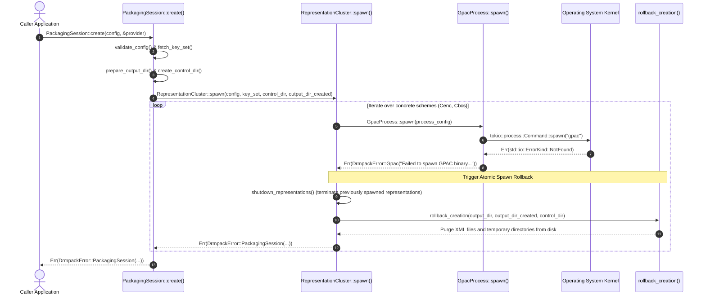

# Research Report: Error Reporting & Resource Cleanup for Missing GPAC Command/Binary in `drmpack`

**Date:** 2026-09-10  
**Scope:** `src/gpac/process.rs`, `src/error.rs`, `src/session/cluster.rs`, `src/session/mod.rs`, `tests/tracer_gpac_e2e.rs`  
**Status:** Completed  

---

## 1. Executive Summary

When `drmpack` runs in an environment where **GPAC is not installed** or the **`gpac` binary cannot be found in `$PATH`**, the system handles and reports the failure according to two primary scenarios with automated rollback mechanisms:

1. **Scenario A (Most Common – Spawn-Time Failure):**
   - **Mechanism:** During `PackagingSession::create()`, the call to `tokio::process::Command::spawn()` fails immediately because the operating system returns `std::io::ErrorKind::NotFound` (OS error 2: *"No such file or directory"*).
   - **Error Type Hierarchy:** The error is encapsulated through:
     `DrmpackError::Gpac` $\to$ `RepresentationFailure` (with `PackagingOperation::Create`) $\to$ `PackagingSessionFailure` $\to$ `DrmpackError::PackagingSession(Arc<PackagingSessionFailure>)`.
   - **Formatted Error Message (`Display`):**
     > `PackagingSession failure: cbcs Representation failed during create: GPAC engine error: Failed to spawn GPAC binary 'gpac': No such file or directory (os error 2). Please ensure GPAC is installed and in PATH.` *(or `cenc Representation...` if CENC or Dual mode iterates CENC first)*.
   - **Rollback Behavior:** All temporary DRM control directories (`control_dir`) and newly generated output directories (`output_dir`) are **atomically wiped from disk**, and any peer representations spawned prior to failure are promptly terminated.

2. **Scenario B (Process Crash with Exit Code 127 – Command Not Found):**
   - **Mechanism:** Occurs when GPAC is invoked through a custom wrapper script, container entrypoint, or shim runner where the wrapper itself executes but the internal `gpac` executable cannot be found (standard POSIX exit code 127).
   - **Error Type Hierarchy:** Captured by `ProcessSupervisor` and the session `Watchdog` task, producing `DrmpackError::ProcessCrashed { exit_code: Some(127), stderr: ... }`.
   - **Actionable Diagnostic Hint:** The `diagnose_gpac_crash` routine inspects exit code `127` and appends a troubleshooting recommendation:
     > `[Hint: 'gpac' executable was not found in PATH. Ensure GPAC (>=2.2) is installed.]`
   - **Formatted Error Message (`Display`):**
     > `PackagingSession failure: <scheme> Representation failed during supervisor exit: GPAC process crashed with exit code Some(127): <stderr> [Hint: 'gpac' executable was not found in PATH. Ensure GPAC (>=2.2) is installed.]`

---

## 2. Detailed Analysis: Scenario A (Spawn-Time Binary Missing, `ErrorKind::NotFound`)

### 2.1. Execution Flow



### 2.2. Source Code Implementation & Error Construction

1. **Child Process Launch & I/O Error Mapping:**  
   In [`src/gpac/process.rs:280-285`](../../src/gpac/process.rs#L280-L285):
   ```rust
   let mut child = cmd.spawn().map_err(|e| {
       DrmpackError::Gpac(format!(
           "Failed to spawn GPAC binary '{}': {}. Please ensure GPAC is installed and in PATH.",
           config.gpac_bin, e
       ))
   })?;
   ```
   When the executable is absent in `$PATH`, `cmd.spawn()` yields `std::io::Error` with `ErrorKind::NotFound` (OS error 2). The `map_err` converts this into `DrmpackError::Gpac`.

2. **Cluster Failure Handling & Rollback:**  
   In [`src/session/cluster.rs:187-199`](../../src/session/cluster.rs#L187-L199):
   ```rust
   match GpacProcess::spawn(process_config).await {
       Ok(process) => {
           representations.push(Representation::new(scheme, process));
       }
       Err(error) => {
           let shutdown_failures =
               shutdown_representations(&mut representations, config.finalization_timeout)
                   .await;
           rollback_creation(&config.output_dir, output_dir_created, Some(control_dir))
               .await;
           return Err(creation_failure(scheme, error, shutdown_failures));
       }
   }
   ```

3. **Creation Failure Data Structure:**  
   In [`src/session/cluster.rs:413-426`](../../src/session/cluster.rs#L413-L426):
   ```rust
   fn creation_failure(
       scheme: EncryptionScheme,
       error: DrmpackError,
       mut shutdown_failures: Vec<RepresentationFailure>,
   ) -> DrmpackError {
       shutdown_failures.push(RepresentationFailure::new(
           scheme,
           PackagingOperation::Create,
           error,
       ));
       DrmpackError::PackagingSession(Arc::new(PackagingSessionFailure::from_failures(
           shutdown_failures,
       )))
   }
   ```

### 2.3. Formatted Error Output

When the caller formats the error with `Display` (`println!("{err}")` or `err.to_string()`):
- Starts with the prefix from `DrmpackError::PackagingSession`: `"PackagingSession failure: "`
- Appends `PackagingSessionFailure::fmt`: aggregates all `RepresentationFailure` entries separated by `"; "`
- Formats `RepresentationFailure`: `"{scheme} Representation failed during {operation}: {error}"`
  - `scheme`: `"cbcs"` (default for `PackagingSessionConfig::new`) or `"cenc"` (in Dual mode where CENC is spawned first).
  - `operation`: `"create"` (corresponding to `PackagingOperation::Create`).
  - `error`: `"GPAC engine error: Failed to spawn GPAC binary 'gpac': No such file or directory (os error 2). Please ensure GPAC is installed and in PATH."`.

**Complete Display String:**
```text
PackagingSession failure: cbcs Representation failed during create: GPAC engine error: Failed to spawn GPAC binary 'gpac': No such file or directory (os error 2). Please ensure GPAC is installed and in PATH.
```

---

## 3. Detailed Analysis: Scenario B (Process Crash with Exit Code 127)

### 3.1. Context

Exit code 127 is the standard POSIX status indicating **"Command not found"**. This occurs when:
- A user configures a custom executable pointing to a shell wrapper script (e.g. `/usr/local/bin/gpac-wrapper.sh`), which executes successfully, but the inner `gpac` invocation cannot be found.
- Running within a containerized or sandboxed environment where an intermediary shim proxy returns exit code 127 upon failure to dispatch the binary.

### 3.2. Monitoring & Diagnostic Logic

1. **ProcessSupervisor Captures Child Exit:**  
   In [`src/gpac/process.rs:347-381`](../../src/gpac/process.rs#L347-L381), the background supervisor task detects process termination:
   ```rust
   res = child.wait() => {
       match res {
           Ok(status) => ProcessExitStatus {
               code: status.code(), // Some(127)
               success: status.success(), // false
           },
           ...
       }
   }
   ```
   This event is broadcast across the `exit_tx` channel.

2. **Watchdog Reaction & Symmetric Fail-Fast:**  
   In [`src/session/mod.rs:1388-1457`](../../src/session/mod.rs#L1388-L1457):
   ```rust
   (scheme, exit_status) = cluster.wait_for_exit() => {
       ...
       let stderr = cluster.get_recent_stderr(scheme).await;
       error!(
           scheme = %scheme,
           exit_code = ?exit_status.code,
           stderr = %stderr,
           "ProcessSupervisor detected premature GPAC subprocess exit"
       );

       let is_active = {
           let mut lifecycle_guard = lifecycle.lock().await;
           if lifecycle_guard.state == SessionState::Active {
               lifecycle_guard.state = SessionState::Failed;
               ...
           }
       };
       // Dual-mode symmetric fail-fast: immediately terminate peer representations
       let peer_failures = cluster.abort_peers(scheme).await;
       let control_cleanup = cleanup_watchdog_dirs(&control_dir).await;
       ...
   }
   ```

3. **Intelligent Diagnostics with `diagnose_gpac_crash`:**  
   In [`src/error.rs:64-76`](../../src/error.rs#L64-L76):
   ```rust
   pub fn diagnose_gpac_crash(exit_code: Option<i32>, stderr: &str) -> &'static str {
       match exit_code {
           Some(127) => " [Hint: 'gpac' executable was not found in PATH. Ensure GPAC (>=2.2) is installed.]",
           Some(137) => " [Hint: GPAC was killed by SIGKILL (Exit code 137, OOM Killer). Check memory and /dev/shm headroom.]",
           Some(139) => " [Hint: GPAC crashed with Segmentation Fault (SIGSEGV). Check if input stream is a valid fMP4 container.]",
           Some(141) => " [Hint: Broken pipe (SIGPIPE). Upstream encoder or pipe writer closed prematurely.]",
           ...
           _ => "",
       }
   }
   ```
   Error definition in `DrmpackError::ProcessCrashed` ([`src/error.rs:36-42`](../../src/error.rs#L36-L42)):
   ```rust
   #[error("GPAC process crashed with exit code {exit_code:?}: {stderr}{}", diagnose_gpac_crash(*exit_code, stderr))]
   ProcessCrashed {
       exit_code: Option<i32>,
       stderr: String,
   },
   ```

### 3.3. Formatted Error Output

Console formatted output for single representation:
```text
PackagingSession failure: cbcs Representation failed during supervisor exit: GPAC process crashed with exit code Some(127): <stderr_content> [Hint: 'gpac' executable was not found in PATH. Ensure GPAC (>=2.2) is installed.]
```

In Dual encryption mode, the surviving peer (`cenc`) is symmetrically aborted, including both failure details:
```text
PackagingSession failure: cbcs Representation failed during supervisor exit: GPAC process crashed with exit code Some(127): ... [Hint: 'gpac' executable was not found in PATH. Ensure GPAC (>=2.2) is installed.]; cenc Representation failed during supervisor exit: Peer representation 'cbcs' terminated unexpectedly; representation aborted
```

---

## 4. Rollback Mechanism & Filesystem Cleanup

Whenever a missing GPAC binary error occurs, `drmpack` guarantees **Zero Disk Leakage**:

### 4.1. The `rollback_creation` Function
Implemented in [`src/session/cluster.rs:428-447`](../../src/session/cluster.rs#L428-L447):

```rust
async fn rollback_creation(
    output_dir: &Path,
    output_dir_created: bool,
    control_dir: Option<&Path>,
) {
    if let Some(control_dir) = control_dir {
        let _ = tokio::fs::remove_dir_all(control_dir).await;
        if let Some(parent) = control_dir.parent() {
            if parent.file_name().and_then(|n| n.to_str()) == Some("drmpack-control") {
                let _ = tokio::fs::remove_dir(parent).await;
            }
        }
    }
    if output_dir_created {
        let _ = tokio::fs::remove_dir_all(output_dir).await;
    } else {
        let _ = tokio::fs::remove_dir_all(output_dir.join("cenc")).await;
        let _ = tokio::fs::remove_dir_all(output_dir.join("cbcs")).await;
    }
}
```

### 4.2. Directory Cleanup Strategy

| Target Directory | Condition | Action Taken | Rationale |
| :--- | :--- | :--- | :--- |
| **`control_dir`** | Always | `tokio::fs::remove_dir_all(control_dir).await` | Deletes DRM XML files containing sensitive keys (`cenc.xml`, `cbcs.xml`) to maintain Secrets Hygiene. |
| **Parent `drmpack-control`** | If empty | `tokio::fs::remove_dir(parent).await` | Prevents lingering empty directory clutter in `/tmp`. |
| **`output_dir` (New)** | `output_dir_created == true` | `tokio::fs::remove_dir_all(output_dir).await` | Cleanly removes the directory that was freshly created for this session. |
| **`output_dir` (Pre-existing)** | `output_dir_created == false` | Only removes `output_dir/cenc` and `output_dir/cbcs` | **Data Safety:** Avoids deleting pre-existing files belonging to the host application in a shared folder. |

---

## 5. Structured Tracing & Logging (`tracing`)

During detection and recovery of missing GPAC binary errors, the following structured log events are emitted:

| Level | Target / Location | Fields | Message |
| :--- | :--- | :--- | :--- |
| `DEBUG` | `drmpack::gpac::process` ([L271](../../src/gpac/process.rs#L271)) | `bin = %config.gpac_bin`, `args = ?args` | `"Spawning GPAC process"` |
| `ERROR` | `drmpack::session::mod` ([L1395](../../src/session/mod.rs#L1395)) *(Scenario B – Exit 127)* | `scheme = %scheme`, `exit_code = ?exit_status.code`, `stderr = %stderr` | `"ProcessSupervisor detected premature GPAC subprocess exit"` |
| `WARN` | `drmpack::session::cluster` ([L350](../../src/session/cluster.rs#L350)) *(Dual mode)* | `failed_scheme = %failed_scheme`, `target_peer = %rep.scheme` | `"Aborting peer representation due to failure in primary representation"` |
| `ERROR` | `drmpack::session::mod` ([L875](../../src/session/mod.rs#L875)) | `failure = %failure` | `"PackagingSession failed terminally"` |

---

## 6. Existing Automated Tests in Repository

This behavior is verified by automated test suites in the codebase:

1. **`tests/tracer_gpac_e2e.rs:28-55`:**  
   `test_packaging_session_detects_missing_gpac_binary`:
   - Configures `config.with_gpac_bin("non_existent_gpac_binary_xyz_123")`.
   - Validates that `PackagingSession::create` returns `DrmpackError::PackagingSession(failure)`.
   - Asserts `failure.cbcs[0].operation == PackagingOperation::Create`.
   - Asserts that the error description contains the missing binary name.

2. **`src/session/cluster.rs:457-487`:**  
   `test_cluster_spawn_rollback_on_missing_gpac`:
   - Tests `RepresentationCluster::spawn` with a nonexistent binary in `Dual` mode.
   - Verifies complete rollback: `!output_dir.exists()` and `!control_dir.exists()`.

3. **`src/session/mod.rs:1522-1537`:**  
   `dual_creation_rollback_removes_created_output`:
   - Verifies that `PackagingSession::create` in dual mode removes newly created output directories upon GPAC spawn failure.

4. **`src/error.rs:230-250`:**  
   `test_diagnose_gpac_crash_hints` & `test_process_crashed_display_includes_hint`:
   - Asserts that `[Hint: 'gpac' executable was not found in PATH. Ensure GPAC (>=2.2) is installed.]` is attached when the exit code is `Some(127)`.

---

## 7. Quick Reference Comparison Matrix

| Property | Scenario A: Missing Binary in PATH at Spawn | Scenario B: Process Crash with Exit Code 127 |
| :--- | :--- | :--- |
| **Detection Phase** | `PackagingSession::create` (Spawn time) | Runtime / Watchdog monitoring |
| **Root Cause** | `std::io::Error` (`ErrorKind::NotFound`) | Child process exits with status code 127 |
| **Inner Error Variant** | `DrmpackError::Gpac(String)` | `DrmpackError::ProcessCrashed { exit_code: Some(127), .. }` |
| **Outer Error Variant** | `DrmpackError::PackagingSession(Arc<PackagingSessionFailure>)` | `DrmpackError::PackagingSession(Arc<PackagingSessionFailure>)` |
| **Associated Operation** | `PackagingOperation::Create` | `PackagingOperation::Supervisor` |
| **Actionable Hint** | Spawn error text: *"Please ensure GPAC is installed and in PATH."* | Attached by `diagnose_gpac_crash`: *"[Hint: 'gpac' executable was not found in PATH. Ensure GPAC (>=2.2) is installed.]"* |
| **Disk Cleanup** | `rollback_creation()` purges `control_dir` and newly created `output_dir` | `cleanup_watchdog_dirs()` purges `control_dir` |
| **Peer Process Handling**| Shuts down / aborts remaining representations | Dispatches `SIGKILL` to abort peer representations (Dual mode) |
